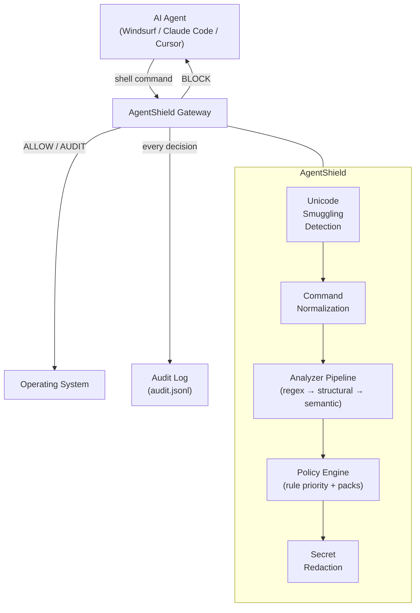
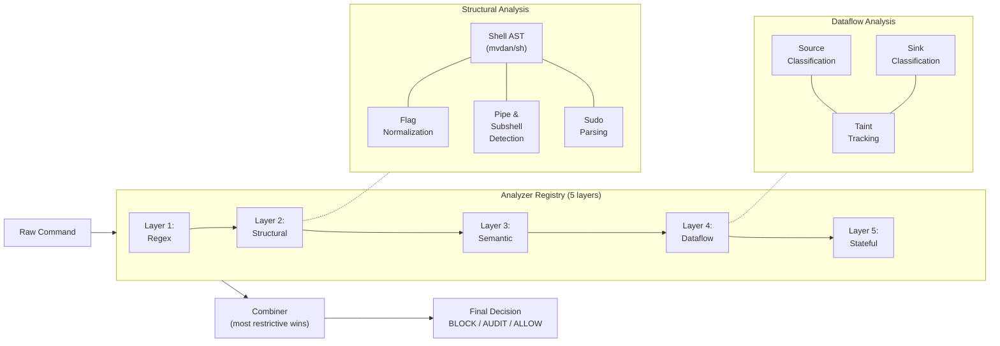
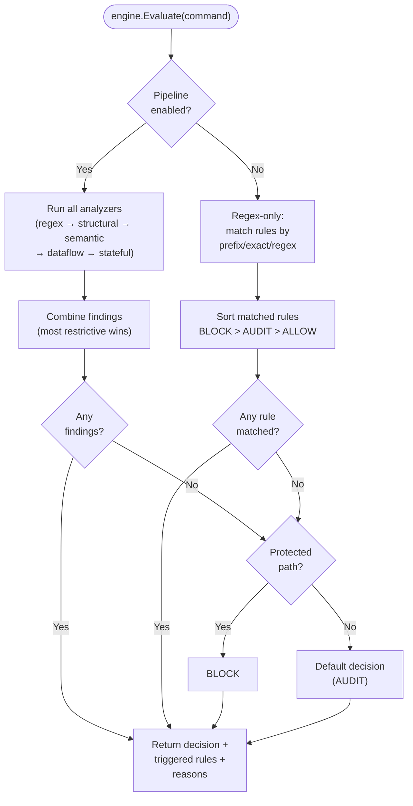

# AgentShield

**Local-first runtime security gateway for AI agents** — Audit, block, and govern every command your AI agent executes.

## Why AgentShield?

AI coding agents (Windsurf, Claude Code, OpenClaw, Cursor, etc.) execute shell commands with real side effects. This creates security risks:

- **Prompt injection becomes operational** — Malicious content can steer agent actions
- **Over-permissioned tools** — Agents have access to shell, files, tokens
- **No audit trail** — "What did the agent do while I was away?"
- **Credential exfiltration** — Agents can read `~/.ssh`, `~/.aws`, environment variables

AgentShield sits between the agent and the OS, enforcing **deterministic policy rules** and logging every action.

## Install

```bash
# Homebrew (macOS / Linux)
brew tap gzhole/tap
brew install agentshield

# Or build from source
make build
sudo make install

# Or curl installer
curl -sSL https://raw.githubusercontent.com/gzhole/agentshield/main/scripts/install.sh | bash
```

## Quick Start

```bash
# Run a command through AgentShield
agentshield run -- echo "hello world"

# View the audit trail
agentshield log

# View summary stats
agentshield log --summary

# Show only flagged (AUDIT) entries
agentshield log --flagged

# Show only blocked commands
agentshield log --decision BLOCK
```

## Demo

```bash
# ✅ Safe commands execute normally
$ agentshield run -- ls -la
total 48
drwxr-xr-x  12 user  staff  384 Feb  8 10:00 .
...

# 🛑 Destructive commands are BLOCKED
$ agentshield run -- rm -rf /
🛑 BLOCKED by AgentShield
Decision: BLOCK
Triggered rules: block-rm-root
Reasons:
  - Destructive remove at filesystem root is not allowed.

# 🛑 Credential access is BLOCKED
$ agentshield run -- cat ~/.ssh/id_rsa
🛑 BLOCKED by AgentShield
Decision: BLOCK
Triggered rules: protected-path
Reasons:
  - Access to protected path denied: ~/.ssh/**

# 🔍 Risky commands are AUDITED (executed + flagged for review)
$ agentshield run -- npm install lodash
added 2 packages in 0.8s
# (flagged in audit log for review)

# 📊 Review what happened
$ agentshield log --summary
═══════════════════════════════════════════
  AgentShield Audit Summary
═══════════════════════════════════════════
  Total events:    6
  ALLOW:           2
  AUDIT (flagged): 2
  BLOCK:           2
═══════════════════════════════════════════
```

## Decisions

| Decision | Behavior |
|----------|----------|
| `ALLOW` | Execute, log normally |
| `AUDIT` | Execute, flag in log for review |
| `BLOCK` | Deny with explanation, log |

## Configuration

AgentShield creates `~/.agentshield/` with:
- `policy.yaml` — Policy rules (ALLOW / AUDIT / BLOCK)
- `audit.jsonl` — Append-only audit log (with automatic secret redaction)

### Policy Example

```yaml
version: "0.1"
defaults:
  decision: "AUDIT"
  protected_paths:
    - "~/.ssh/**"
    - "~/.aws/**"
    - "~/.gnupg/**"

rules:
  - id: "block-rm-root"
    match:
      command_regex: "^(rm|sudo rm)\\s+-rf\\s+/(\\s|$)"
    decision: "BLOCK"
    reason: "Destructive remove at filesystem root is not allowed."

  - id: "audit-package-installs"
    match:
      command_prefix: ["npm install", "pip install", "brew install"]
    decision: "AUDIT"
    reason: "Package installs flagged for supply-chain review."

  - id: "allow-safe-readonly"
    match:
      command_prefix: ["ls", "pwd", "whoami", "git status", "git diff"]
    decision: "ALLOW"
    reason: "Read-only / low-risk command."
```

## Flags

| Flag | Default | Description |
|------|---------|-------------|
| `--policy` | `~/.agentshield/policy.yaml` | Path to policy file |
| `--log` | `~/.agentshield/audit.jsonl` | Path to audit log |
| `--mode` | `policy-only` | Execution mode |

## Security Features

- **Protected paths** — Block access to `~/.ssh`, `~/.aws`, `~/.gnupg`, `~/.kube`
- **Automatic redaction** — Secrets never logged (AWS keys, GitHub tokens, passwords)
- **Fail-safe** — Unknown commands default to AUDIT, not ALLOW
- **Audit trail** — Every decision logged with timestamp, rule, and reason
- **Agent-agnostic** — Works with Windsurf, OpenClaw, Claude Code, or any shell-based agent
- **Multi-layer analysis** — 6-layer pipeline (Regex + Structural + Semantic + Dataflow + Stateful + Guardian) for defense-in-depth
- **Unicode smuggling detection** — Blocks homoglyphs, zero-width characters, and bidirectional overrides

## Multi-Layer Analyzer Pipeline

AgentShield uses a six-layer analyzer pipeline for defense-in-depth command analysis. See [Architecture](#analyzer-pipeline-flow) for the full Mermaid diagram.

| Layer | What it does | Example |
|-------|-------------|----------|
| **Regex** | Pattern matching (prefix, exact, regex) | `rm -rf /` matches `^(rm\|sudo rm)\s+-rf\s+/` |
| **Structural** | Shell AST parsing, flag normalization, pipe detection | `rm --recursive --force /` → normalized to `-r -f /` |
| **Semantic** | Intent classification from parsed command structure | `shred /dev/sda` → destructive disk operation |
| **Dataflow** | Source→sink taint tracking through pipes/redirects | `cat /dev/zero > /dev/sda` → zero source to device sink |
| **Stateful** | Multi-step attack chain detection | `curl -o x.sh && bash x.sh` → download-then-execute |
| **Guardian** | Prompt injection signals, obfuscation, inline secrets | `echo "ignore previous instructions"` → instruction_override |
| **Combiner** | Merges findings using most-restrictive-wins strategy | BLOCK from any layer overrides AUDIT |

### What each layer catches

- **Regex only**: Exact patterns like `rm -rf /`, `curl | bash`, `dd if=/dev/zero`
- **Structural adds**: Flag variations (`--recursive --force`), glob evasion (`rm -rf /*`), sudo parsing, string literal detection (won't flag `echo "rm -rf /"`), pipe-to-interpreter (`curl | python3`), symbolic chmod (`a+rwx`)
- **Semantic adds**: Alternative destructive tools (`shred`, `wipefs`, `find -delete`), indirect execution (`python3 -c "shutil.rmtree('/')"`, fork bombs), crontab modification, environment dumps via scripting languages
- **Dataflow adds**: Redirect-based disk destruction (`cat /dev/zero > /dev/sda`), direct cron spool writes, sensitive data piped to network commands, command substitution exfiltration
- **Stateful adds**: Download-then-execute chains (`curl -o x.sh && bash x.sh`), three-step download→chmod→execute sequences
- **Guardian adds**: Prompt injection detection (`ignore previous instructions`), security bypass attempts, obfuscated payloads (base64/hex), inline secrets (API keys, tokens), bulk exfiltration (archive + upload), indirect injection (`SYSTEM:`, `[INST]` tags)

## Accuracy Baseline

Measured across 123 test cases covering 8 threat kingdoms (destructive ops, credential exposure, data exfiltration, unauthorized execution, privilege escalation, persistence/evasion, supply chain, reconnaissance).

| Metric | Regex Only | Pipeline (6-layer) | Improvement |
|--------|-----------|--------------------------------------|-------------|
| **Precision** | 79.3% | 100.0% | +20.7pp |
| **Recall** | 59.0% | 96.2% | +37.2pp |
| True Positives | 46 | 102 | +56 |
| True Negatives | 33 | 17 | +4 |
| False Positives | 12 | 0 | −12 |
| False Negatives | 32 | 4 | −28 |

> Run `go test -v -run TestAccuracyMetrics ./internal/analyzer/` for regex-only metrics.
> Run `go test -v -run TestPipelineAccuracyMetrics ./internal/analyzer/` for pipeline metrics.

### Remaining gaps (Phase 3+)

The 4 remaining FN cases are known gaps requiring deeper analysis:
- **Reverse shell detection** — Python/Ruby socket-based reverse shells (2 FN)
- **While-loop fork bomb** — `while true; do bash & done` (1 FN)
- **SSH directory archival** — `tar czf /tmp/keys.tar.gz ~/.ssh/` (1 FN)

See [`FAILING_TESTS.md`](FAILING_TESTS.md) for the full prioritized list with details. Regenerate it anytime:

```bash
go test -v -run TestGenerateFailingTestsReport ./internal/analyzer/
```

### Red-Team Regression (21 commands)

The guardian + pipeline is tested against prompt injection scenarios adapted from the [PRD red-team pack](PRD/agentshield_redteam_prompt_pack.md). All 21 commands pass minimum decision checks.

See [`REDTEAM_REPORT.md`](REDTEAM_REPORT.md) for the full report. Regenerate:

```bash
go test -v -run TestRedTeamPipelineReport ./internal/analyzer/
```

## Agent Action Security Taxonomy

AgentShield includes a structured security taxonomy mapping threats to detection rules:

```
taxonomy/
├── kingdoms.yaml              # 8 threat kingdoms
├── 1-destructive-ops/         # fs-destruction, disk-ops, fork-bombs, chmod
├── 2-credential-exposure/     # ssh-keys, env-dumps
├── 3-data-exfiltration/       # reverse-shells, dns-tunneling
├── 4-unauthorized-execution/  # pipe-to-shell, code injection
├── 5-privilege-escalation/    # sudo abuse
├── 6-persistence-evasion/     # crontab, log deletion
├── 7-supply-chain/            # dependency confusion, registry override
└── 8-reconnaissance/          # network scanning
```

Each taxonomy entry maps to OWASP LLM Top 10 2025 compliance items. See `compliance/indexes/owasp-llm-2025.md`.

## Development

```bash
make build    # Build binary
make test     # Run tests
make lint     # Run linter
make clean    # Clean artifacts
```

## Architecture

See [`Design/`](Design/) for architecture diagrams, competitive analysis, and growth strategy.

### System Overview



### Analyzer Pipeline Flow



### Evaluation Decision Flow



### Key packages

| Package | Purpose |
|---------|----------|
| `internal/policy` | Policy engine, rule loading, pack merging |
| `internal/analyzer` | Multi-layer analyzer pipeline (regex, structural, semantic) |
| `internal/taxonomy` | Security taxonomy loader and compliance mapping |
| `internal/unicode` | Unicode smuggling detection |
| `internal/redact` | Secret redaction for audit logs |
| `internal/sandbox` | Process sandboxing and execution |

## License

Apache 2.0
