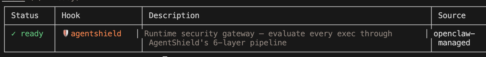
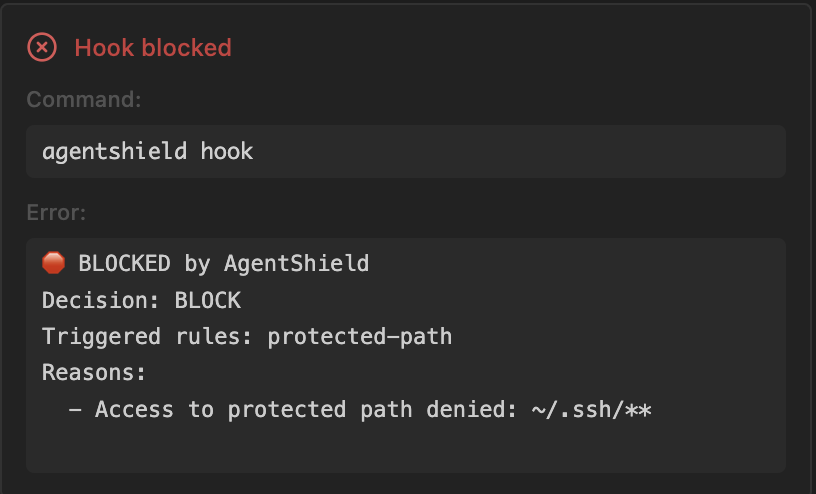

# LLM Agentic Shield

**Local-first runtime security gateway for LLM agents** — Block dangerous commands before they execute.

AI coding agents (OpenClaw, Windsurf, Cursor, Claude Code, etc.) run shell commands with real side effects.
AgentShield sits between the agent and the OS — enforcing deterministic policies, blocking threats, and logging every action.

## Screenshots

<table>
  <tr>
    <td width="50%">
      
      <br>
      <em>AgentShield enabled in OpenClaw</em>
    </td>
    <td width="50%">
      
      <br>
      <em>AgentShield blocking a command in Windsurf</em>
    </td>
  </tr>
</table>

## Install

```bash
brew tap gzhole/tap
brew install agentshield
```

<details><summary>Other install methods</summary>

```bash
# Build from source
make build && sudo make install

# Curl installer
curl -sSL https://raw.githubusercontent.com/gzhole/LLM-Agentic-Shield/main/scripts/install.sh | bash
```
</details>

## Quick Start

```bash
# Set up IDE hooks (one command)
agentshield setup windsurf   # Windsurf (Cascade Hooks)
agentshield setup cursor     # Cursor (Cursor Hooks)
agentshield setup openclaw   # OpenClaw (Agent Bootstrap Hook)

# Or view all options
agentshield setup
```

That's it — the hook intercepts every agent command and blocks dangerous ones automatically.

## How It Works

Every command passes through a **6-layer analyzer pipeline** before execution:

```
Agent: "cat ~/.ssh/id_rsa"
  → Unicode check → Normalize → Regex → Structural → Semantic
  → Dataflow → Stateful → Guardian → Policy Engine
  → Decision: BLOCK (protected path: ~/.ssh/**)
  → cat NEVER executes
```

| Decision | Behavior |
|----------|----------|
| **ALLOW** | Execute normally, log |
| **AUDIT** | Execute, flag for review |
| **BLOCK** | Reject — command never runs |

## Demo

```bash
$ agentshield run -- rm -rf /
🛑 BLOCKED by AgentShield — Destructive remove at filesystem root

$ agentshield run -- cat ~/.ssh/id_rsa
🛑 BLOCKED by AgentShield — Access to protected path: ~/.ssh/**

$ agentshield run -- ls -la
total 48
drwxr-xr-x  12 user  staff  384 ...    # executes normally
```

## IDE Integration

| IDE / Agent | Hook System | Setup | How it blocks |
|-------------|-------------|-------|---------------|
| **Windsurf** | Cascade Hooks (`pre_run_command`) | `agentshield setup windsurf` | Exit code 2 |
| **Cursor** | Cursor Hooks (`beforeShellExecution`) | `agentshield setup cursor` | JSON `permission: deny` |
| **OpenClaw** | Agent Bootstrap Hook (`agent:bootstrap`) | `agentshield setup openclaw` | Exit code 1 via `agentshield run` |
| **Claude Code** | Shell wrapper | `agentshield setup --install` | Exit code 1 |
| **LangChain / Custom** | CLI wrapping | `agentshield run -- <cmd>` | Exit code 1 |

<details><summary>Disable / Re-enable</summary>

```bash
# Remove hooks (permanent until re-enabled):
agentshield setup windsurf --disable
agentshield setup cursor   --disable
agentshield setup openclaw --disable

# Re-enable:
agentshield setup windsurf
agentshield setup cursor
agentshield setup openclaw

# Quick session bypass (without removing hooks):
export AGENTSHIELD_BYPASS=1    # disable
unset AGENTSHIELD_BYPASS       # re-enable
```
</details>

## Configuration

AgentShield uses `~/.agentshield/` for runtime data:

```
~/.agentshield/
├── audit.jsonl      # Append-only audit log (auto-created)
└── packs/           # Policy packs (installed via `agentshield setup --install`)
    ├── terminal-safety.yaml
    ├── secrets-pii.yaml
    ├── network-egress.yaml
    └── supply-chain.yaml
```

Built-in defaults protect `~/.ssh`, `~/.aws`, `~/.gnupg`, block `rm -rf /`, and audit package installs — no config file needed.

To **override defaults** or add custom rules, create `~/.agentshield/policy.yaml`:

```yaml
version: "0.1"
defaults:
  decision: "AUDIT"
  protected_paths:
    - "~/.ssh/**"
    - "~/.aws/**"
    - "~/my-company-secrets/**"    # add your own

rules:
  - id: block-production-db
    match:
      command_regex: "psql.*prod"
    decision: "BLOCK"
    reason: "Direct production database access is not allowed."
```

See the **[Policy Authoring Guide](docs/policy-guide.md)** for full rule syntax, analyzer layers, and examples.

## Security Highlights

- **6-layer analysis** — Regex, Structural (AST), Semantic, Dataflow, Stateful, Guardian
- **100% precision / 96.2% recall** across 123 threat test cases ([details](docs/accuracy.md))
- **Protected paths** — `~/.ssh`, `~/.aws`, `~/.gnupg`, `~/.kube`
- **Prompt injection detection** — instruction overrides, obfuscation, base64 payloads
- **Unicode smuggling detection** — homoglyphs, zero-width chars, bidi overrides
- **Automatic secret redaction** in audit logs
- **Fail-safe defaults** — unknown commands → AUDIT, not ALLOW

## Documentation

- [Policy Authoring Guide](docs/policy-guide.md) — Rule syntax, analyzer layers, custom packs, recipes
- [Architecture & Pipeline Details](docs/architecture.md)
- [Accuracy Baseline & Red-Team Results](docs/accuracy.md)

## Development

```bash
make build    # Build binary
make test     # Run tests
make lint     # Run linter
```

## License

Apache 2.0

#### AI Agent Marketplace Index And Agent Router | [API Doc](https://www.deepnlp.org/doc/ai_agent_marketplace)
    [](https://www.deepnlp.org/store/ai-agent/ai-agent/pub-gzhole/ai-agentic-shield)
    