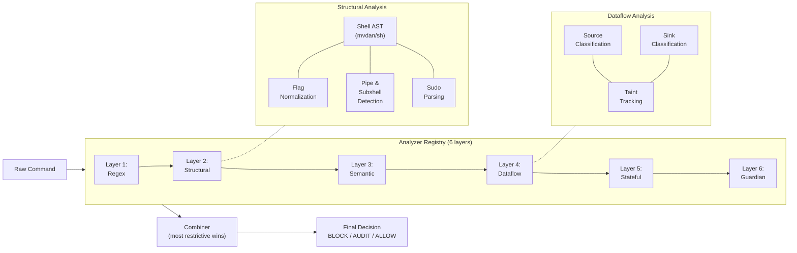

# AgentShield

**Local-first runtime security gateway for AI agents** — Audit, block, and govern every command your AI agent executes.

## Why AgentShield?

AI coding agents (Windsurf, Claude Code, OpenClaw, Cursor, etc.) execute shell commands with real side effects. This creates security risks:

- **Prompt injection becomes operational** — Malicious content can steer agent actions
- **Over-permissioned tools** — Agents have access to shell, files, tokens
- **No audit trail** — "What did the agent do while I was away?"
- **Credential exfiltration** — Agents can read `~/.ssh`, `~/.aws`, environment variables

AgentShield sits between the agent and the OS, enforcing **deterministic policy rules** and logging every action.

## How It Works

AgentShield is a **command wrapper** — it evaluates every command *before* execution and only runs it if the policy allows.

```
Agent wants to run: cat ~/.ssh/id_rsa

┌─────────────────────────────────────────────────────┐
│  agentshield run -- cat ~/.ssh/id_rsa               │
│                                                     │
│  1. Receive command string (cat never runs yet)     │
│  2. Normalize paths (~/.ssh/id_rsa → /home/u/.ssh/) │
│  3. Check protected paths → MATCH: ~/.ssh/**        │
│  4. Run 6-layer analyzer pipeline (if no early exit)│
│  5. Decision: BLOCK                                 │
│  6. Print error, exit(1) — cat NEVER executes       │
└─────────────────────────────────────────────────────┘
```

The critical point: **the dangerous command never runs**. AgentShield receives the command as a string argument, evaluates it through the policy engine, and only calls the real binary (`exec.Command`) if the decision is `ALLOW` or `AUDIT`. On `BLOCK`, it exits immediately with a non-zero exit code.

### Decision Flow

| Decision | What happens |
|----------|-------------|
| `ALLOW` | Execute the command, log normally |
| `AUDIT` | Execute the command, flag in audit log for review |
| `BLOCK` | **Do not execute.** Print explanation to stderr, log, exit with code 1 |

### What AgentShield Is NOT

- **Not a kernel-level interceptor** — it doesn't hook syscalls or use eBPF
- **Not a firewall** — it doesn't monitor network traffic
- **Not an LLM guardrail** — it doesn't filter prompts sent to models

It is a **deterministic policy gate** that wraps command execution. If a command doesn't go through `agentshield run --`, it isn't intercepted. This is by design — the enforcement boundary is explicit and auditable.

## Agent vs Human: Who Gets Intercepted?

AgentShield **does not magically distinguish** between agent and human commands. The distinction comes from **deployment**:

| Scenario | How it works |
|----------|-------------|
| **Agent commands intercepted** | Configure the AI agent's shell/executor to route through AgentShield (see [Agent Integration](#agent-integration)) |
| **Human commands unintercepted** | Humans use their normal shell — no AgentShield in the path |
| **Both intercepted** | Source the shell wrapper in `.zshrc` — every command goes through AgentShield |

The recommended deployment: **put AgentShield in the agent's execution path only**. Humans retain full shell access; agents are governed.

## Agent Integration

### Method 1: Shell Wrapper (Recommended for IDE Agents)

Most AI coding agents (Windsurf, Claude Code, Cursor, etc.) spawn a shell to execute commands. Configure the agent to use AgentShield's wrapper shell:

```bash
# Install the wrapper
sudo cp scripts/agentshield-wrapper.sh /usr/local/share/agentshield/

# Configure your IDE agent to use this as its shell:
#   Shell path: /bin/zsh
#   Shell args: -c "source /usr/local/share/agentshield/agentshield-wrapper.sh && eval \"$@\""
#
# Or set the agent's shell environment variable (agent-specific):
export AGENT_SHELL="source /usr/local/share/agentshield/agentshield-wrapper.sh"
```

When the wrapper is loaded, every command the agent runs is routed through `agentshield run --` automatically. The wrapper skips shell builtins (`cd`, `export`, etc.) to avoid breaking normal shell behavior.

### Method 2: Direct CLI Wrapping (For Agent Frameworks)

If you control the agent's code (LangChain, AutoGen, CrewAI, custom agents), replace the shell execution call:

```python
# Before (unprotected):
import subprocess
result = subprocess.run(["cat", "/etc/passwd"], capture_output=True)

# After (protected):
result = subprocess.run(
    ["agentshield", "run", "--", "cat", "/etc/passwd"],
    capture_output=True
)
# If BLOCK: exit code 1, stderr has explanation
# If ALLOW/AUDIT: stdout/stderr from the real command
```

```go
// Go example
cmd := exec.Command("agentshield", "run", "--", "cat", "/etc/passwd")
```

### Method 3: PATH Interception (For Maximum Coverage)

Create command-specific interceptors that shadow system binaries:

```bash
# Create interceptor directory
sudo mkdir -p /usr/local/lib/agentshield/bin

# Create interceptors for dangerous commands
for cmd in rm git curl wget ssh scp; do
  cat > "/usr/local/lib/agentshield/bin/$cmd" << 'EOF'
#!/bin/sh
exec agentshield run -- /usr/bin/$cmd "$@"
EOF
  chmod +x "/usr/local/lib/agentshield/bin/$cmd"
done

# Prepend to the agent's PATH (not your own shell)
export PATH="/usr/local/lib/agentshield/bin:$PATH"
```

### Bypass for Humans

If you source the wrapper globally but want to bypass for interactive use:

```bash
# Temporarily disable
export AGENTSHIELD_BYPASS=1

# Re-enable
unset AGENTSHIELD_BYPASS
```

## Install

```bash
# Homebrew (macOS / Linux)
brew tap gzhole/tap
brew install agentshield

# Or build from source
make build
sudo make install

# Or curl installer
curl -sSL https://raw.githubusercontent.com/gzhole/agentshield/main/scripts/install.sh | bash
```

## Quick Start

```bash
# Run a command through AgentShield
agentshield run -- echo "hello world"

# View the audit trail
agentshield log

# View summary stats
agentshield log --summary

# Show only flagged (AUDIT) entries
agentshield log --flagged

# Show only blocked commands
agentshield log --decision BLOCK
```

## Demo

```bash
# ✅ Safe commands execute normally
$ agentshield run -- ls -la
total 48
drwxr-xr-x  12 user  staff  384 Feb  8 10:00 .
...

# 🛑 Destructive commands are BLOCKED
$ agentshield run -- rm -rf /
🛑 BLOCKED by AgentShield
Decision: BLOCK
Triggered rules: block-rm-root
Reasons:
  - Destructive remove at filesystem root is not allowed.

# 🛑 Credential access is BLOCKED
$ agentshield run -- cat ~/.ssh/id_rsa
🛑 BLOCKED by AgentShield
Decision: BLOCK
Triggered rules: protected-path
Reasons:
  - Access to protected path denied: ~/.ssh/**

# 🔍 Risky commands are AUDITED (executed + flagged for review)
$ agentshield run -- npm install lodash
added 2 packages in 0.8s
# (flagged in audit log for review)

# 📊 Review what happened
$ agentshield log --summary
═══════════════════════════════════════════
  AgentShield Audit Summary
═══════════════════════════════════════════
  Total events:    6
  ALLOW:           2
  AUDIT (flagged): 2
  BLOCK:           2
═══════════════════════════════════════════
```

## Configuration

AgentShield creates `~/.agentshield/` with:
- `policy.yaml` — Policy rules (ALLOW / AUDIT / BLOCK)
- `audit.jsonl` — Append-only audit log (with automatic secret redaction)

### Policy Example

```yaml
version: "0.1"
defaults:
  decision: "AUDIT"
  protected_paths:
    - "~/.ssh/**"
    - "~/.aws/**"
    - "~/.gnupg/**"

rules:
  - id: "block-rm-root"
    match:
      command_regex: "^(rm|sudo rm)\\s+-rf\\s+/(\\s|$)"
    decision: "BLOCK"
    reason: "Destructive remove at filesystem root is not allowed."

  - id: "audit-package-installs"
    match:
      command_prefix: ["npm install", "pip install", "brew install"]
    decision: "AUDIT"
    reason: "Package installs flagged for supply-chain review."

  - id: "allow-safe-readonly"
    match:
      command_prefix: ["ls", "pwd", "whoami", "git status", "git diff"]
    decision: "ALLOW"
    reason: "Read-only / low-risk command."
```

## Flags

| Flag | Default | Description |
|------|---------|-------------|
| `--policy` | `~/.agentshield/policy.yaml` | Path to policy file |
| `--log` | `~/.agentshield/audit.jsonl` | Path to audit log |
| `--mode` | `policy-only` | Execution mode |

## Security Features

- **Protected paths** — Block access to `~/.ssh`, `~/.aws`, `~/.gnupg`, `~/.kube`
- **Automatic redaction** — Secrets never logged (AWS keys, GitHub tokens, passwords)
- **Fail-safe** — Unknown commands default to AUDIT, not ALLOW
- **Audit trail** — Every decision logged with timestamp, rule, and reason
- **Agent-agnostic** — Works with Windsurf, OpenClaw, Claude Code, or any shell-based agent
- **Multi-layer analysis** — 6-layer pipeline (Regex + Structural + Semantic + Dataflow + Stateful + Guardian) for defense-in-depth
- **Unicode smuggling detection** — Blocks homoglyphs, zero-width characters, and bidirectional overrides

## Multi-Layer Analyzer Pipeline

AgentShield uses a six-layer analyzer pipeline for defense-in-depth command analysis. See [Architecture](#analyzer-pipeline-flow) for the full Mermaid diagram.

| Layer | What it does | Example |
|-------|-------------|----------|
| **Regex** | Pattern matching (prefix, exact, regex) | `rm -rf /` matches `^(rm\|sudo rm)\s+-rf\s+/` |
| **Structural** | Shell AST parsing, flag normalization, pipe detection | `rm --recursive --force /` → normalized to `-r -f /` |
| **Semantic** | Intent classification from parsed command structure | `shred /dev/sda` → destructive disk operation |
| **Dataflow** | Source→sink taint tracking through pipes/redirects | `cat /dev/zero > /dev/sda` → zero source to device sink |
| **Stateful** | Multi-step attack chain detection | `curl -o x.sh && bash x.sh` → download-then-execute |
| **Guardian** | Prompt injection signals, obfuscation, inline secrets | `echo "ignore previous instructions"` → instruction_override |
| **Combiner** | Merges findings using most-restrictive-wins strategy | BLOCK from any layer overrides AUDIT |

### What each layer catches

- **Regex only**: Exact patterns like `rm -rf /`, `curl | bash`, `dd if=/dev/zero`
- **Structural adds**: Flag variations (`--recursive --force`), glob evasion (`rm -rf /*`), sudo parsing, string literal detection (won't flag `echo "rm -rf /"`), pipe-to-interpreter (`curl | python3`), symbolic chmod (`a+rwx`)
- **Semantic adds**: Alternative destructive tools (`shred`, `wipefs`, `find -delete`), indirect execution (`python3 -c "shutil.rmtree('/')"`, fork bombs), crontab modification, environment dumps via scripting languages
- **Dataflow adds**: Redirect-based disk destruction (`cat /dev/zero > /dev/sda`), direct cron spool writes, sensitive data piped to network commands, command substitution exfiltration
- **Stateful adds**: Download-then-execute chains (`curl -o x.sh && bash x.sh`), three-step download→chmod→execute sequences
- **Guardian adds**: Prompt injection detection (`ignore previous instructions`), security bypass attempts, obfuscated payloads (base64/hex), inline secrets (API keys, tokens), bulk exfiltration (archive + upload), indirect injection (`SYSTEM:`, `[INST]` tags)

## Accuracy Baseline

Measured across 123 test cases covering 8 threat kingdoms (destructive ops, credential exposure, data exfiltration, unauthorized execution, privilege escalation, persistence/evasion, supply chain, reconnaissance).

| Metric | Regex Only | Pipeline (6-layer) | Improvement |
|--------|-----------|--------------------------------------|-------------|
| **Precision** | 79.3% | 100.0% | +20.7pp |
| **Recall** | 59.0% | 96.2% | +37.2pp |
| True Positives | 46 | 102 | +56 |
| True Negatives | 33 | 17 | +4 |
| False Positives | 12 | 0 | −12 |
| False Negatives | 32 | 4 | −28 |

> Run `go test -v -run TestAccuracyMetrics ./internal/analyzer/` for regex-only metrics.
> Run `go test -v -run TestPipelineAccuracyMetrics ./internal/analyzer/` for pipeline metrics.

### Remaining gaps (Phase 3+)

The 4 remaining FN cases are known gaps requiring deeper analysis:
- **Reverse shell detection** — Python/Ruby socket-based reverse shells (2 FN)
- **While-loop fork bomb** — `while true; do bash & done` (1 FN)
- **SSH directory archival** — `tar czf /tmp/keys.tar.gz ~/.ssh/` (1 FN)

See [`FAILING_TESTS.md`](FAILING_TESTS.md) for the full prioritized list with details. Regenerate it anytime:

```bash
go test -v -run TestGenerateFailingTestsReport ./internal/analyzer/
```

### Red-Team Regression (21 commands)

The guardian + pipeline is tested against prompt injection scenarios adapted from the [PRD red-team pack](PRD/agentshield_redteam_prompt_pack.md). All 21 commands pass minimum decision checks.

See [`REDTEAM_REPORT.md`](REDTEAM_REPORT.md) for the full report. Regenerate:

```bash
go test -v -run TestRedTeamPipelineReport ./internal/analyzer/
```

## Agent Action Security Taxonomy

AgentShield includes a structured security taxonomy mapping threats to detection rules:

```
taxonomy/
├── kingdoms.yaml              # 8 threat kingdoms
├── 1-destructive-ops/         # fs-destruction, disk-ops, fork-bombs, chmod
├── 2-credential-exposure/     # ssh-keys, env-dumps
├── 3-data-exfiltration/       # reverse-shells, dns-tunneling
├── 4-unauthorized-execution/  # pipe-to-shell, code injection
├── 5-privilege-escalation/    # sudo abuse
├── 6-persistence-evasion/     # crontab, log deletion
├── 7-supply-chain/            # dependency confusion, registry override
└── 8-reconnaissance/          # network scanning
```

Each taxonomy entry maps to OWASP LLM Top 10 2025 compliance items. See `compliance/indexes/owasp-llm-2025.md`.

## Development

```bash
make build    # Build binary
make test     # Run tests
make lint     # Run linter
make clean    # Clean artifacts
```

## Architecture

See [`Design/`](Design/) for architecture diagrams, competitive analysis, and growth strategy.

### System Overview

```mermaid
flowchart TB
    Agent["AI Agent\n(Windsurf / Claude Code / Cursor)"]
    AS["AgentShield Gateway"]
    OS["Operating System"]
    Log["Audit Log\n(audit.jsonl)"]

    Agent -->|"shell command"| AS
    AS -->|"ALLOW / AUDIT"| OS
    AS -->|"BLOCK"| Agent
    AS -->|"every decision"| Log

    subgraph AgentShield
        direction TB
        Unicode["Unicode\nSmuggling\nDetection"]
        Norm["Command\nNormalization"]
        Pipeline["Analyzer Pipeline\n(6-layer: regex → structural →\nsemantic → dataflow → stateful → guardian)"]
        Policy["Policy Engine\n(rule priority + packs)"]
        Redact["Secret\nRedaction"]

        Unicode --> Norm --> Pipeline --> Policy --> Redact
    end

    AS --- AgentShield
```



### Analyzer Pipeline Flow



### Evaluation Decision Flow


### Key packages

| Package | Purpose |
|---------|----------|
| `internal/policy` | Policy engine, rule loading, pack merging |
| `internal/analyzer` | Multi-layer analyzer pipeline (regex, structural, semantic, dataflow, stateful) |
| `internal/guardian` | Prompt injection detection (9 heuristic signals) |
| `internal/taxonomy` | Security taxonomy loader and compliance mapping |
| `internal/unicode` | Unicode smuggling detection |
| `internal/redact` | Secret redaction for audit logs |

## License

Apache 2.0
