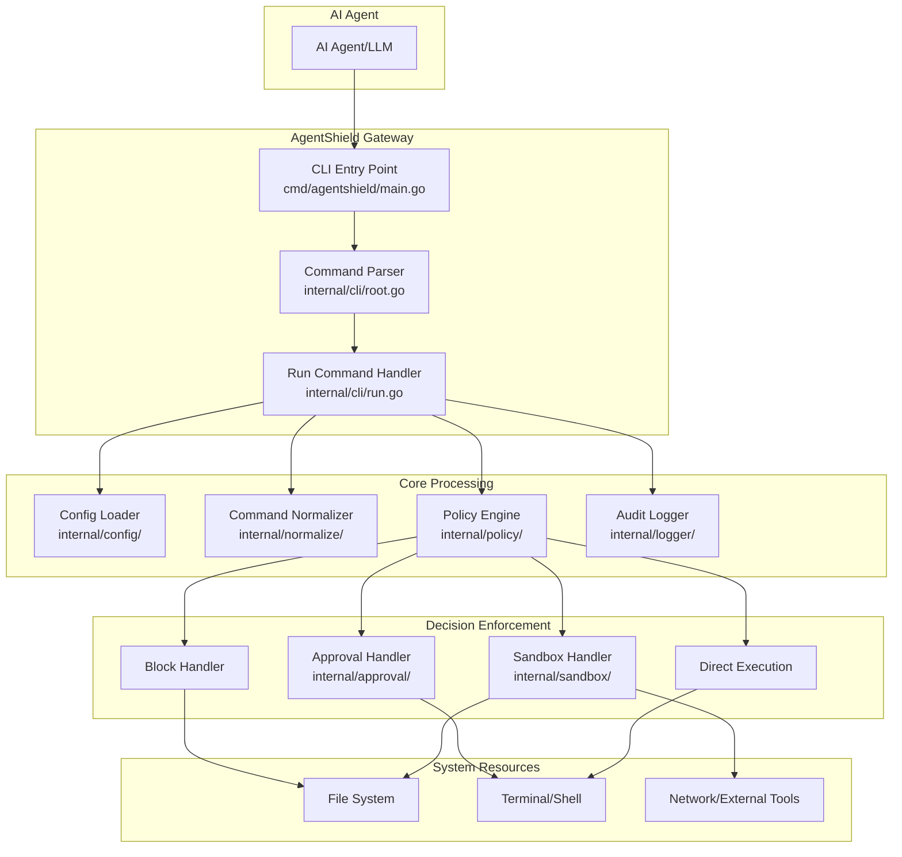
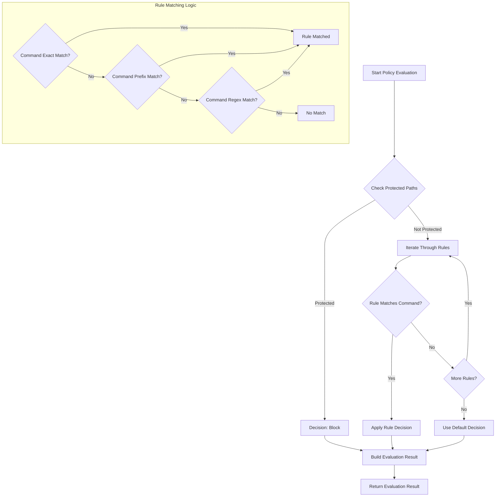
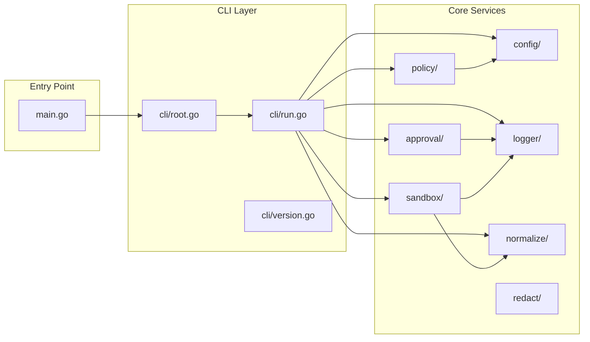
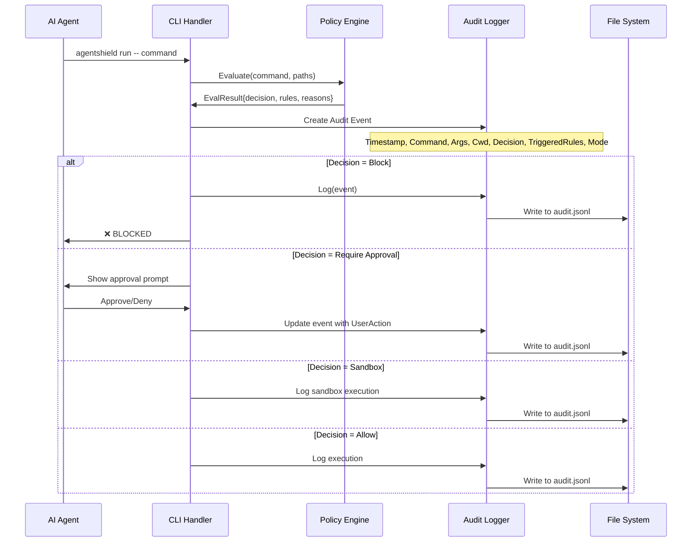
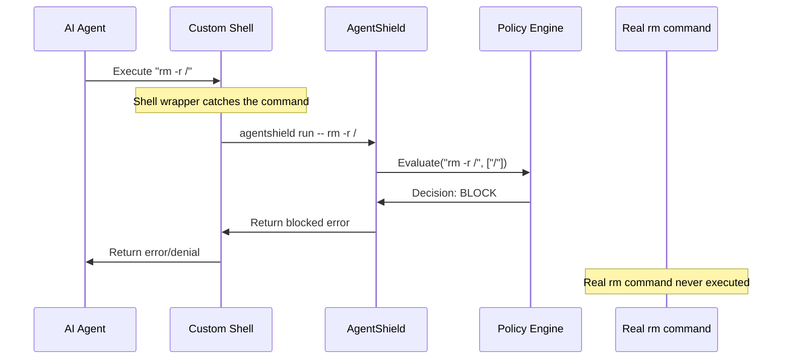
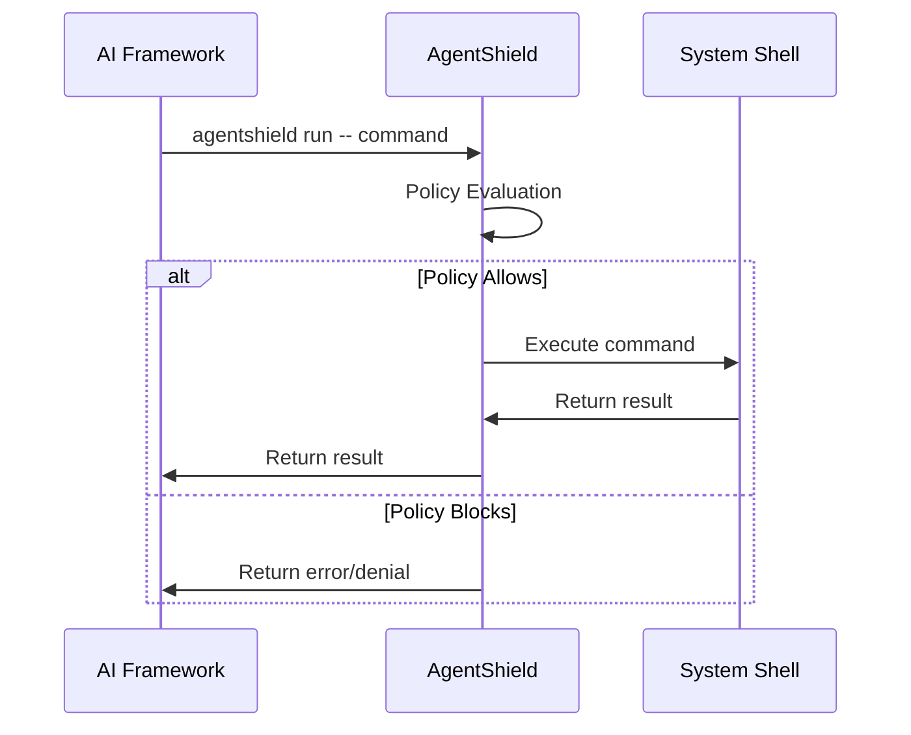

# AgentShield Architecture & Development Guide

## Overview

AgentShield is a local-first security gateway that sits between AI agents and high-risk tools, enforcing deterministic policies to prevent prompt-injection-driven damage, data exfiltration, and destructive actions.

## Architecture Flow Diagrams

### 1. High-Level System Architecture



### 2. Command Execution Flow


### 3. Policy Engine Decision Flow



### 4. Internal Package Dependencies



### 5. Data Flow for Audit Logging



## Key Components Explained

### Main Entry Point (`cmd/agentshield/main.go`)
- Simple entry point that delegates to CLI package
- Handles error reporting and exit codes

### CLI Package (`internal/cli/`)
- **root.go**: Defines main CLI structure using Cobra framework
- **run.go**: Core command execution logic with policy enforcement
- **version.go**: Version information

### Core Processing Packages

#### Config (`internal/config/`)
- Loads configuration from default locations or user-specified paths
- Manages policy and log file paths
- Creates `.agentshield` directory in user home

#### Policy Engine (`internal/policy/`)
- **engine.go**: Core policy evaluation logic
- **loader.go**: Policy file loading from YAML
- **types.go**: Policy data structures
- Rule matching supports exact match, prefix match, and regex patterns
- Protected path checking with glob patterns

#### Normalizer (`internal/normalize/`)
- Extracts file paths from commands
- Normalizes relative paths to absolute paths
- Handles path expansion and resolution

#### Sandbox (`internal/sandbox/`)
- Creates isolated environments for command execution
- Captures file system changes
- Provides diff summaries for user review
- Applies approved changes to real system

#### Approval (`internal/approval/`)
- Interactive user prompts for approval decisions
- Formats approval requests with rule explanations
- Captures user actions for audit logging

#### Logger (`internal/logger/`)
- Structured audit logging in JSONL format
- Tracks all command executions and decisions
- Provides security audit trail

#### Redact (`internal/redact/`)
- Sensitive data redaction for logging
- Prevents secrets from appearing in audit logs

## Development Workflow

1. **Policy Development**: Create YAML policy files with rules and protected paths
2. **Testing**: Use sandbox mode to preview changes
3. **Audit Review**: Monitor audit logs for security events
4. **Configuration**: Customize paths and modes as needed

## Deployment & Command Interception

### Deployment Strategies

AgentShield can intercept AI agent commands through several deployment approaches:

#### 1. Shell Wrapper Method (Recommended)

The Shell Wrapper Method intercepts commands by replacing the AI agent's shell or by modifying how the agent executes commands.

##### Method A: Shell Replacement

```bash
# Create a custom shell that routes everything through AgentShield
#!/bin/bash
# /usr/local/bin/agentshield-shell

# This replaces bash/zsh for the AI agent
# All commands executed by the agent go through this shell

execute_with_agentshield() {
    local cmd="$*"
    echo "🛡️  Executing through AgentShield: $cmd" >&2
    /usr/local/bin/agentshield run -- $cmd
}

# Override built-in command execution
# This catches direct command execution
if [ $# -eq 0 ]; then
    # Interactive mode - read commands line by line
    while read -e -p "agentshield> " cmd; do
        execute_with_agentshield "$cmd"
    done
else
    # Non-interactive mode - execute the passed command
    execute_with_agentshield "$@"
fi
```

##### Method B: Command Function Override

```bash
# ~/.agentshield/wrapper.sh
#!/bin/bash

# Override dangerous commands with AgentShield wrappers
rm() {
    echo "🛡️  Intercepted rm command" >&2
    /usr/local/bin/agentshield run -- rm "$@"
}

git() {
    echo "🛡️  Intercepted git command" >&2
    /usr/local/bin/agentshield run -- git "$@"
}

sudo() {
    echo "🛡️  Intercepted sudo command" >&2
    /usr/local/bin/agentshield run -- sudo "$@"
}

# Catch-all for any other command
command_not_found_handle() {
    echo "🛡️  Intercepted command: $*" >&2
    /usr/local/bin/agentshield run -- "$@"
}
```

##### Method C: Subprocess Wrapper (Most Reliable)

```bash
#!/bin/bash
# ~/.agentshield/agent-wrapper.sh

# This script is set as the AI agent's shell or command executor
# It intercepts ALL subprocess executions

log_command() {
    echo "[$(date)] Agent executing: $*" >> ~/.agentshield/agent-commands.log
}

# Override exec to catch all command executions
exec() {
    log_command "exec $*"
    /usr/local/bin/agentshield run -- "$@"
}

# Main execution logic
if [ $# -gt 0 ]; then
    log_command "$*"
    /usr/local/bin/agentshield run -- "$@"
else
    # Interactive shell mode
    export PS1="🛡️ agentshield> "
    while IFS= read -e -r cmd; do
        if [ -n "$cmd" ]; then
            log_command "$cmd"
            /usr/local/bin/agentshield run -- $cmd
        fi
    done
fi
```

##### How `rm -r /` Gets Intercepted:



##### Installation Steps:

```bash
# 1. Build and install AgentShield
go build -o agentshield cmd/agentshield/main.go
sudo cp agentshield /usr/local/bin/

# 2. Create the wrapper script
sudo mkdir -p /usr/local/lib/agentshield
sudo tee /usr/local/lib/agentshield/agent-wrapper.sh << 'EOF'
#!/bin/bash
/usr/local/bin/agentshield run -- "$@"
EOF
sudo chmod +x /usr/local/lib/agentshield/agent-wrapper.sh

# 3. Configure the AI agent to use the wrapper
# Method 1: Set the agent's shell
export AGENT_SHELL="/usr/local/lib/agentshield/agent-wrapper.sh"

# Method 2: For Python subprocess calls
export PYTHON_AGENT_WRAPPER="/usr/local/lib/agentshield/agent-wrapper.sh"

# Method 3: Modify the agent's configuration
# In agent config: "shell": "/usr/local/lib/agentshield/agent-wrapper.sh"
```

##### Integration with Popular AI Frameworks:

**LangChain Integration:**
```python
import subprocess
from langchain.tools import ShellTool

class AgentShieldTool(ShellTool):
    def run(self, command: str) -> str:
        # Route through AgentShield wrapper
        result = subprocess.run([
            '/usr/local/lib/agentshield/agent-wrapper.sh', 
            '-c', command
        ], capture_output=True, text=True)
        
        if result.returncode != 0:
            raise Exception(f"Command blocked: {result.stderr}")
        return result.stdout

# Replace the default shell tool
tools = [AgentShieldTool()]
```

**AutoGen Integration:**
```python
from autogen import AssistantAgent, UserProxyAgent

def agentshield_command_execution(command: str):
    import subprocess
    result = subprocess.run([
        '/usr/local/lib/agentshield/agent-wrapper.sh', 
        '-c', command
    ], capture_output=True, text=True)
    return result.stdout, result.stderr, result.returncode

# Configure the agent to use AgentShield
user_proxy = UserProxyAgent(
    name="user_proxy",
    code_execution_config={
        "executor": agentshield_command_execution
    }
)
```

##### Verification:

```bash
# Test the interception
/usr/local/lib/agentshield/agent-wrapper.sh "rm -r /"
# Should show: ❌ BLOCKED by AgentShield

# Check audit log
tail -f ~/.agentshield/audit.jsonl
# Should show the blocked rm command
```

This method ensures **100% command interception** because the AI agent thinks it's using a normal shell, but every command gets routed through AgentShield first.

#### 2. PATH Manipulation

```bash
# Add AgentShield directory to PATH before system binaries
export PATH="/usr/local/lib/agentshield:$PATH"

# Create command-specific interceptors
# /usr/local/lib/agentshield/rm -> calls agentshield run -- rm "$@"
# /usr/local/lib/agentshield/git -> calls agentshield run -- git "$@"
```

#### 3. AI Framework Integration



### Implementation Examples

#### For Claude/Anthropic

```python
# In your AI agent code
import subprocess

def safe_execute(command):
    result = subprocess.run([
        'agentshield', 'run', '--'
    ] + command, capture_output=True, text=True)
    return result.stdout, result.stderr, result.returncode

# Usage
output, error, code = safe_execute(['rm', '-rf', '/important/file'])
```

#### For Custom AI Agents

```bash
# Configure the agent's shell environment
export AGENTSHIELD_POLICY="/path/to/strict-policy.yaml"
export AGENTSHIELD_MODE="guardian"

# Agent commands automatically go through AgentShield
agent_command() {
    agentshield run -- "$@"
}
```

### Configuration for Different Environments

#### Development Environment
```yaml
# ~/.agentshield/policy.yaml
defaults:
  decision: "allow"
  protected_paths:
    - "~/.ssh/**"
    - "~/.aws/**"
    - "/etc/**"

rules:
  - id: "dev-block"
    decision: "block"
    match:
      command_prefix: ["rm -rf /", "sudo rm"]
    reason: "Dangerous system commands blocked in dev"
```

#### Production Environment
```yaml
# /etc/agentshield/production-policy.yaml
defaults:
  decision: "require_approval"
  protected_paths:
    - "/var/log/**"
    - "/etc/**"
    - "/usr/bin/**"
    - "~/.ssh/**"
    - "~/.aws/**"

rules:
  - id: "prod-sandbox"
    decision: "sandbox"
    match:
      command_prefix: ["git", "npm", "pip"]
    reason: "Code changes require sandbox review"
```

### Monitoring & Auditing

```bash
# Real-time monitoring
tail -f ~/.agentshield/audit.jsonl

# Security dashboard
agentshield dashboard --show-blocked --show-approved

# Alert on suspicious activity
agentshield monitor --alert-on "rm *, sudo *, git push"
```

## Security Model

- **Defense in Depth**: Multiple layers of security checks
- **Fail Safe**: Default to blocking when uncertain
- **Audit Trail**: Complete logging of all actions
- **User Control**: Approval workflows for risky operations
- **Sandboxing**: Isolated execution for preview capabilities
