# AgentShield Architecture & Development Guide

## Overview

AgentShield is a local-first security gateway that sits between AI agents and high-risk tools, enforcing deterministic policies to prevent prompt-injection-driven damage, data exfiltration, and destructive actions.

## Architecture Flow Diagrams

### 1. High-Level System Architecture

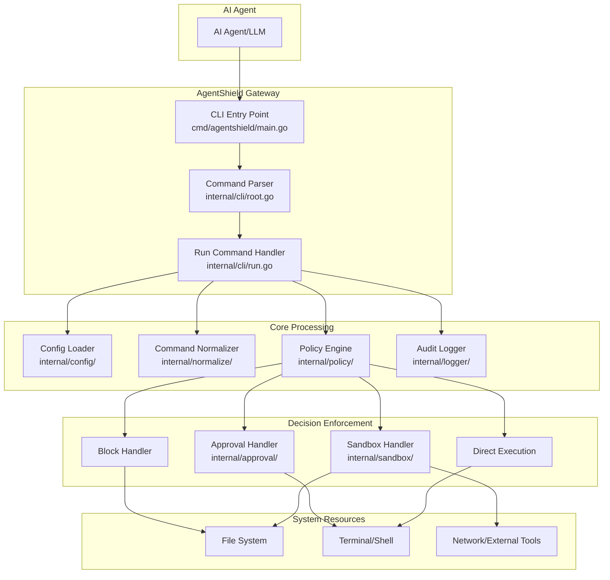

### 2. Command Execution Flow

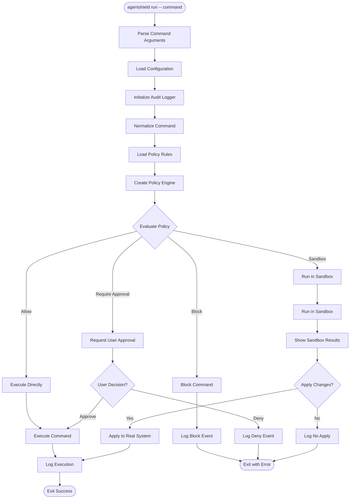

### 3. Policy Engine Decision Flow

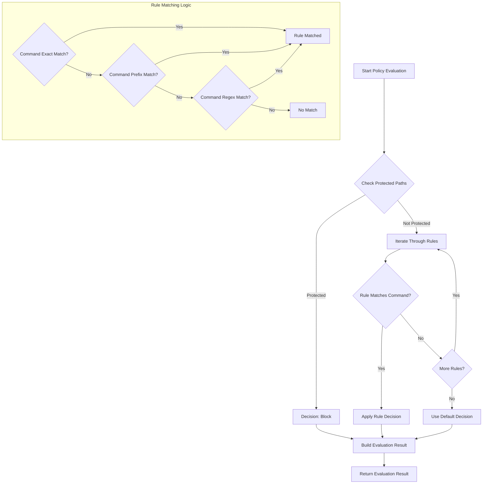

### 4. Internal Package Dependencies

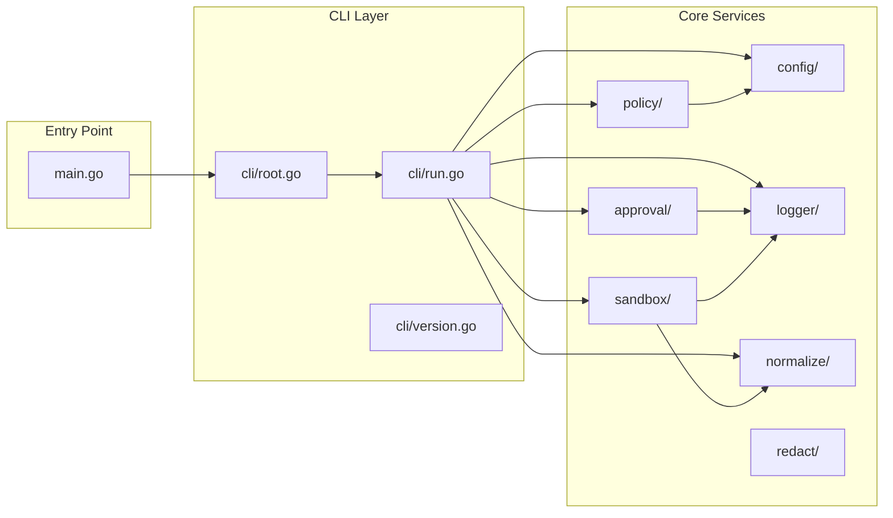

### 5. Data Flow for Audit Logging

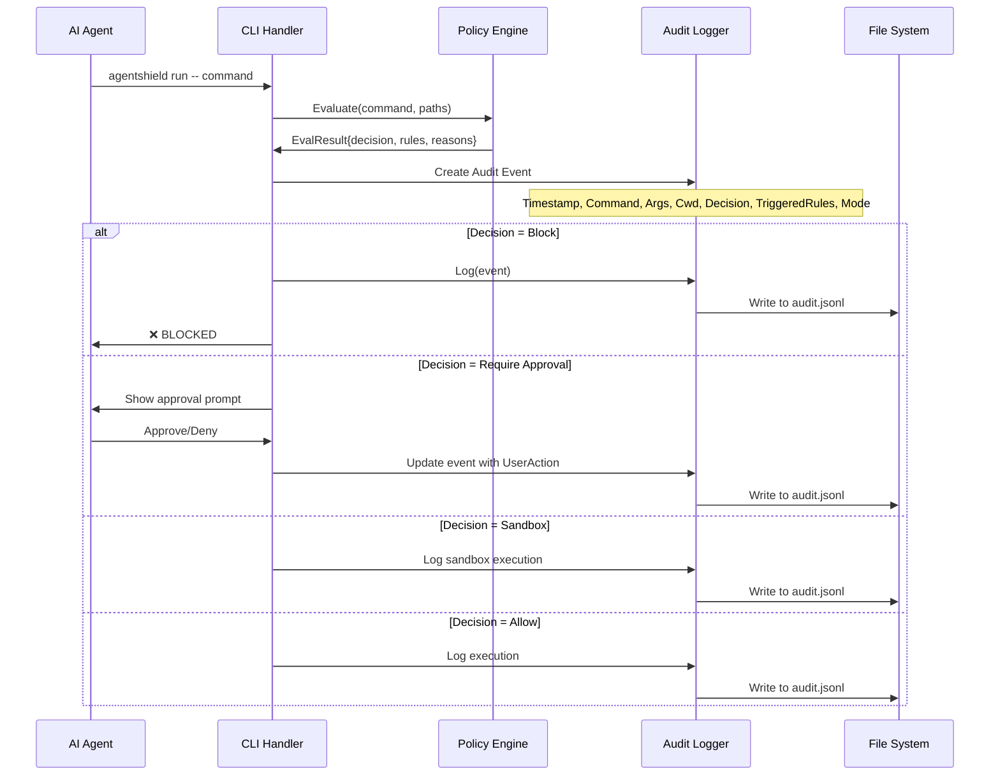

## Key Components Explained

### Main Entry Point (`cmd/agentshield/main.go`)
- Simple entry point that delegates to CLI package
- Handles error reporting and exit codes

### CLI Package (`internal/cli/`)
- **root.go**: Defines main CLI structure using Cobra framework
- **run.go**: Core command execution logic with policy enforcement
- **version.go**: Version information

### Core Processing Packages

#### Config (`internal/config/`)
- Loads configuration from default locations or user-specified paths
- Manages policy and log file paths
- Creates `.agentshield` directory in user home

#### Policy Engine (`internal/policy/`)
- **engine.go**: Core policy evaluation logic
- **loader.go**: Policy file loading from YAML
- **types.go**: Policy data structures
- Rule matching supports exact match, prefix match, and regex patterns
- Protected path checking with glob patterns

#### Normalizer (`internal/normalize/`)
- Extracts file paths from commands
- Normalizes relative paths to absolute paths
- Handles path expansion and resolution

#### Sandbox (`internal/sandbox/`)
- Creates isolated environments for command execution
- Captures file system changes
- Provides diff summaries for user review
- Applies approved changes to real system

#### Approval (`internal/approval/`)
- Interactive user prompts for approval decisions
- Formats approval requests with rule explanations
- Captures user actions for audit logging

#### Logger (`internal/logger/`)
- Structured audit logging in JSONL format
- Tracks all command executions and decisions
- Provides security audit trail

#### Redact (`internal/redact/`)
- Sensitive data redaction for logging
- Prevents secrets from appearing in audit logs

## Development Workflow

1. **Policy Development**: Create YAML policy files with rules and protected paths
2. **Testing**: Use sandbox mode to preview changes
3. **Audit Review**: Monitor audit logs for security events
4. **Configuration**: Customize paths and modes as needed

## Deployment & Command Interception

### Deployment Strategies

AgentShield can intercept AI agent commands through several deployment approaches:

#### 1. Shell Wrapper Method (Recommended)

The Shell Wrapper Method intercepts commands by replacing the AI agent's shell or by modifying how the agent executes commands.

##### Method A: Shell Replacement

```bash
# Create a custom shell that routes everything through AgentShield
#!/bin/bash
# /usr/local/bin/agentshield-shell

# This replaces bash/zsh for the AI agent
# All commands executed by the agent go through this shell

execute_with_agentshield() {
    local cmd="$*"
    echo "🛡️  Executing through AgentShield: $cmd" >&2
    /usr/local/bin/agentshield run -- $cmd
}

# Override built-in command execution
# This catches direct command execution
if [ $# -eq 0 ]; then
    # Interactive mode - read commands line by line
    while read -e -p "agentshield> " cmd; do
        execute_with_agentshield "$cmd"
    done
else
    # Non-interactive mode - execute the passed command
    execute_with_agentshield "$@"
fi
```

##### Method B: Command Function Override

```bash
# ~/.agentshield/wrapper.sh
#!/bin/bash

# Override dangerous commands with AgentShield wrappers
rm() {
    echo "🛡️  Intercepted rm command" >&2
    /usr/local/bin/agentshield run -- rm "$@"
}

git() {
    echo "🛡️  Intercepted git command" >&2
    /usr/local/bin/agentshield run -- git "$@"
}

sudo() {
    echo "🛡️  Intercepted sudo command" >&2
    /usr/local/bin/agentshield run -- sudo "$@"
}

# Catch-all for any other command
command_not_found_handle() {
    echo "🛡️  Intercepted command: $*" >&2
    /usr/local/bin/agentshield run -- "$@"
}
```

##### Method C: Subprocess Wrapper (Most Reliable)

```bash
#!/bin/bash
# ~/.agentshield/agent-wrapper.sh

# This script is set as the AI agent's shell or command executor
# It intercepts ALL subprocess executions

log_command() {
    echo "[$(date)] Agent executing: $*" >> ~/.agentshield/agent-commands.log
}

# Override exec to catch all command executions
exec() {
    log_command "exec $*"
    /usr/local/bin/agentshield run -- "$@"
}

# Main execution logic
if [ $# -gt 0 ]; then
    log_command "$*"
    /usr/local/bin/agentshield run -- "$@"
else
    # Interactive shell mode
    export PS1="🛡️ agentshield> "
    while IFS= read -e -r cmd; do
        if [ -n "$cmd" ]; then
            log_command "$cmd"
            /usr/local/bin/agentshield run -- $cmd
        fi
    done
fi
```

##### How `rm -r /` Gets Intercepted:

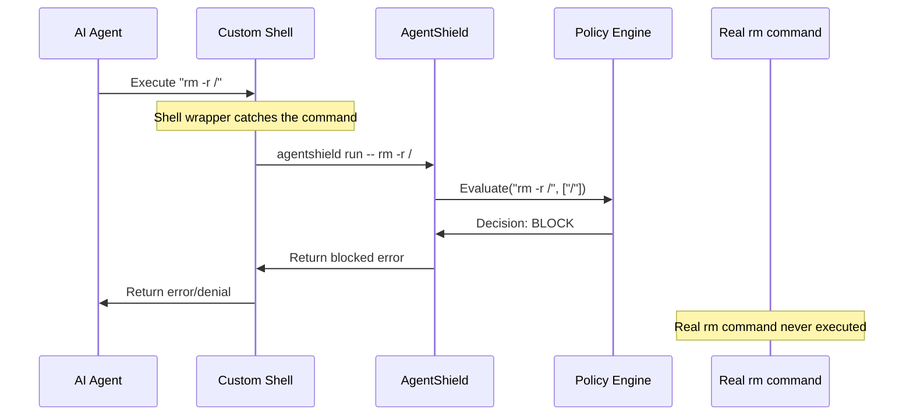

##### Installation Steps:

```bash
# 1. Build and install AgentShield
go build -o agentshield cmd/agentshield/main.go
sudo cp agentshield /usr/local/bin/

# 2. Create the wrapper script
sudo mkdir -p /usr/local/lib/agentshield
sudo tee /usr/local/lib/agentshield/agent-wrapper.sh << 'EOF'
#!/bin/bash
/usr/local/bin/agentshield run -- "$@"
EOF
sudo chmod +x /usr/local/lib/agentshield/agent-wrapper.sh

# 3. Configure the AI agent to use the wrapper
# Method 1: Set the agent's shell
export AGENT_SHELL="/usr/local/lib/agentshield/agent-wrapper.sh"

# Method 2: For Python subprocess calls
export PYTHON_AGENT_WRAPPER="/usr/local/lib/agentshield/agent-wrapper.sh"

# Method 3: Modify the agent's configuration
# In agent config: "shell": "/usr/local/lib/agentshield/agent-wrapper.sh"
```

##### Integration with Popular AI Frameworks:

**LangChain Integration:**
```python
import subprocess
from langchain.tools import ShellTool

class AgentShieldTool(ShellTool):
    def run(self, command: str) -> str:
        # Route through AgentShield wrapper
        result = subprocess.run([
            '/usr/local/lib/agentshield/agent-wrapper.sh', 
            '-c', command
        ], capture_output=True, text=True)
        
        if result.returncode != 0:
            raise Exception(f"Command blocked: {result.stderr}")
        return result.stdout

# Replace the default shell tool
tools = [AgentShieldTool()]
```

**AutoGen Integration:**
```python
from autogen import AssistantAgent, UserProxyAgent

def agentshield_command_execution(command: str):
    import subprocess
    result = subprocess.run([
        '/usr/local/lib/agentshield/agent-wrapper.sh', 
        '-c', command
    ], capture_output=True, text=True)
    return result.stdout, result.stderr, result.returncode

# Configure the agent to use AgentShield
user_proxy = UserProxyAgent(
    name="user_proxy",
    code_execution_config={
        "executor": agentshield_command_execution
    }
)
```

##### Verification:

```bash
# Test the interception
/usr/local/lib/agentshield/agent-wrapper.sh "rm -r /"
# Should show: ❌ BLOCKED by AgentShield

# Check audit log
tail -f ~/.agentshield/audit.jsonl
# Should show the blocked rm command
```

This method ensures **100% command interception** because the AI agent thinks it's using a normal shell, but every command gets routed through AgentShield first.

#### 2. PATH Manipulation

```bash
# Add AgentShield directory to PATH before system binaries
export PATH="/usr/local/lib/agentshield:$PATH"

# Create command-specific interceptors
# /usr/local/lib/agentshield/rm -> calls agentshield run -- rm "$@"
# /usr/local/lib/agentshield/git -> calls agentshield run -- git "$@"
```

#### 3. AI Framework Integration

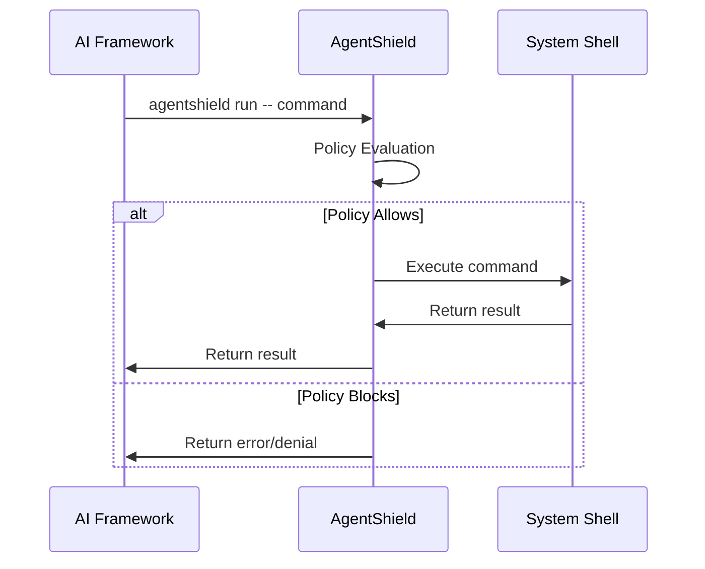

### Implementation Examples

#### For Claude/Anthropic

```python
# In your AI agent code
import subprocess

def safe_execute(command):
    result = subprocess.run([
        'agentshield', 'run', '--'
    ] + command, capture_output=True, text=True)
    return result.stdout, result.stderr, result.returncode

# Usage
output, error, code = safe_execute(['rm', '-rf', '/important/file'])
```

#### For Custom AI Agents

```bash
# Configure the agent's shell environment
export AGENTSHIELD_POLICY="/path/to/strict-policy.yaml"
export AGENTSHIELD_MODE="guardian"

# Agent commands automatically go through AgentShield
agent_command() {
    agentshield run -- "$@"
}
```

### Configuration for Different Environments

#### Development Environment
```yaml
# ~/.agentshield/policy.yaml
defaults:
  decision: "allow"
  protected_paths:
    - "~/.ssh/**"
    - "~/.aws/**"
    - "/etc/**"

rules:
  - id: "dev-block"
    decision: "block"
    match:
      command_prefix: ["rm -rf /", "sudo rm"]
    reason: "Dangerous system commands blocked in dev"
```

#### Production Environment
```yaml
# /etc/agentshield/production-policy.yaml
defaults:
  decision: "require_approval"
  protected_paths:
    - "/var/log/**"
    - "/etc/**"
    - "/usr/bin/**"
    - "~/.ssh/**"
    - "~/.aws/**"

rules:
  - id: "prod-sandbox"
    decision: "sandbox"
    match:
      command_prefix: ["git", "npm", "pip"]
    reason: "Code changes require sandbox review"
```

### Monitoring & Auditing

```bash
# Real-time monitoring
tail -f ~/.agentshield/audit.jsonl

# Security dashboard
agentshield dashboard --show-blocked --show-approved

# Alert on suspicious activity
agentshield monitor --alert-on "rm *, sudo *, git push"
```

## Sandbox Mode Deep Dive

### How Sandbox Mode Works

Sandbox mode provides a **preview-and-approve** workflow for potentially dangerous commands. It creates a temporary copy of the workspace, executes the command there, captures all changes, and presents them for user review before applying to the real system.

### Sandbox Execution Flow

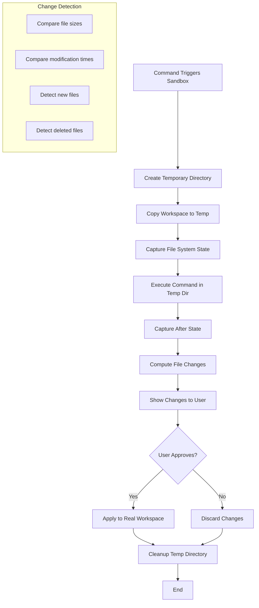

### Code Walkthrough

#### 1. Sandbox Runner Initialization

```go
// internal/sandbox/sandbox.go:31-44
func NewRunner(workDir string) (*Runner, error) {
    isGit := isGitRepo(workDir)  // Check if workspace is a git repo
    
    tempDir, err := os.MkdirTemp("", "agentshield-sandbox-*")
    if err != nil {
        return nil, fmt.Errorf("failed to create temp dir: %w", err)
    }

    return &Runner{
        workDir: workDir,  // Original workspace directory
        tempDir: tempDir,  // Temporary sandbox directory  
        isGit:   isGit,    // Git repository flag
    }, nil
}
```

**Key Points:**
- Creates a temporary directory with prefix `agentshield-sandbox-*`
- Detects if the workspace is a git repository (for future git-aware features)
- Stores both original and temporary directory paths

#### 2. Workspace Copying

```go
// internal/sandbox/sandbox.go:94-96
func (r *Runner) copyWorkspace() error {
    return copyDir(r.workDir, r.tempDir)
}

// internal/sandbox/sandbox.go:204-231
func copyDir(src, dst string) error {
    return filepath.Walk(src, func(path string, info os.FileInfo, err error) error {
        // Skip .git directories to avoid repository contamination
        if info.Name() == ".git" && info.IsDir() {
            return filepath.SkipDir
        }
        
        // Copy directories and files with preserved permissions
        if info.IsDir() {
            return os.MkdirAll(dstPath, info.Mode())
        }
        return copyFile(path, dstPath, info.Mode())
    })
}
```

**Key Points:**
- Recursively copies the entire workspace to temp directory
- **Skips `.git` directories** to prevent sandbox contamination
- Preserves file permissions and directory structure
- Creates an exact replica for isolated execution

#### 3. State Capture

```go
// internal/sandbox/sandbox.go:104-136
func (r *Runner) captureState() (map[string]fileState, error) {
    state := make(map[string]fileState)
    maxFiles := 10000  // Prevent excessive file scanning
    
    err := filepath.Walk(r.tempDir, func(path string, info os.FileInfo, err error) error {
        if info.IsDir() {
            return nil  // Skip directories, only track files
        }
        
        relPath, _ := filepath.Rel(r.tempDir, path)
        state[relPath] = fileState{
            size:    info.Size(),           // File size in bytes
            modTime: info.ModTime().UnixNano(),  // Modification timestamp
            exists:  true,                 // File existence flag
        }
        return nil
    })
    return state, err
}
```

**Key Points:**
- Captures **file size** and **modification time** for every file
- Stores relative paths to enable comparison
- Limits to 10,000 files to prevent performance issues
- Creates a snapshot "before" and "after" for diff computation

#### 4. Command Execution in Sandbox

```go
// internal/sandbox/sandbox.go:52-83
func (r *Runner) Run(args []string) Result {
    // 1. Copy workspace to temp directory
    if err := r.copyWorkspace(); err != nil {
        return Result{Error: fmt.Errorf("failed to copy workspace: %w", err)}
    }

    // 2. Capture state before execution
    beforeState, err := r.captureState()
    
    // 3. Execute command in TEMP directory (not original!)
    cmd := exec.Command(args[0], args[1:]...)
    cmd.Dir = r.tempDir  // <-- Critical: Execute in sandbox, not original
    cmd.Stdout = os.Stdout
    cmd.Stderr = os.Stderr
    cmdErr := cmd.Run()

    // 4. Capture state after execution
    afterState, err := r.captureState()
    
    // 5. Compute changes
    changes := r.computeChanges(beforeState, afterState)
    diffSummary := r.buildDiffSummary(changes)

    return Result{
        Success:      cmdErr == nil,
        ChangedFiles: changes,
        DiffSummary:  diffSummary,
        Error:        cmdErr,
    }
}
```

**Critical Insight:** The command executes **only in the temp directory**, leaving the original workspace untouched.

#### 5. Change Detection Algorithm

```go
// internal/sandbox/sandbox.go:138-169
func (r *Runner) computeChanges(before, after map[string]fileState) []FileChange {
    changes := []FileChange{}

    // Detect ADDED and MODIFIED files
    for path, afterInfo := range after {
        beforeInfo, existed := before[path]
        if !existed {
            // File didn't exist before = ADDED
            changes = append(changes, FileChange{
                Path:      path,
                Action:    "added",
                SizeDelta: afterInfo.size,
            })
        } else if afterInfo.modTime != beforeInfo.modTime || afterInfo.size != beforeInfo.size {
            // File changed = MODIFIED
            changes = append(changes, FileChange{
                Path:      path,
                Action:    "modified", 
                SizeDelta: afterInfo.size - beforeInfo.size,
            })
        }
    }

    // Detect DELETED files
    for path := range before {
        if _, exists := after[path]; !exists {
            changes = append(changes, FileChange{
                Path:      path,
                Action:    "deleted",
                SizeDelta: -before[path].size,
            })
        }
    }
    return changes
}
```

**Detection Logic:**
- **Added**: File exists in "after" but not "before"
- **Modified**: File exists in both but size or timestamp changed
- **Deleted**: File exists in "before" but not "after"

#### 6. User Approval Workflow

```go
// internal/cli/run.go:138-189
case policy.DecisionSandbox:
    fmt.Fprintln(os.Stderr, "\n🔒 SANDBOX MODE")
    
    // 1. Create sandbox runner
    runner, err := sandbox.NewRunner(cwd)
    defer runner.Cleanup()  // Always cleanup temp directory
    
    // 2. Run command in sandbox
    result := runner.Run(args)
    
    // 3. Show results to user
    fmt.Fprintln(os.Stderr, "\n🔍 Sandbox Results:")
    fmt.Fprintln(os.Stderr, result.DiffSummary)
    
    // 4. If no changes, exit early
    if len(result.ChangedFiles) == 0 {
        fmt.Fprintln(os.Stderr, "No changes detected. Nothing to apply.")
        return nil
    }
    
    // 5. Ask for user approval
    approvalResult := approval.Ask(prompt)
    if !approvalResult.Approved {
        fmt.Fprintln(os.Stderr, "\n❌ Changes not applied")
        os.Exit(1)
    }
    
    // 6. Apply to REAL workspace
    fmt.Fprintln(os.Stderr, "\n✅ Applying changes to real workspace...")
    if err := runner.Apply(args); err != nil {
        // Handle error
    }
```

### Example Usage

```bash
# Policy triggers sandbox for git commands
agentshield run -- git add . && git commit -m "dangerous changes"

# Output:
🔒 SANDBOX MODE
Running command in sandbox to preview changes...

🔍 Sandbox Results:
3 file(s) changed:
  + src/new_file.js (new, 1234 bytes)
  ~ package.json (+15 bytes)
  - old_file.js (removed)

Summary: 1 added, 1 modified, 1 deleted

╔══════════════════════════════════════════════════════════════╗
║              ⚠️  APPROVAL REQUIRED                            ║
╚══════════════════════════════════════════════════════════════╝
Command: git add . && git commit -m "dangerous changes"
Reasons:
  • Review the changes above before applying

Options:
  [a] Approve once - execute this command
  [d] Deny - block this command

Your choice [a/d]: a

✅ Applying changes to real workspace...
Changes applied successfully.
```

### Security Model & Human Approval Challenge

#### The Critical Flaw: Self-Approval

You're absolutely right - there's a **critical security vulnerability** in the current sandbox model:

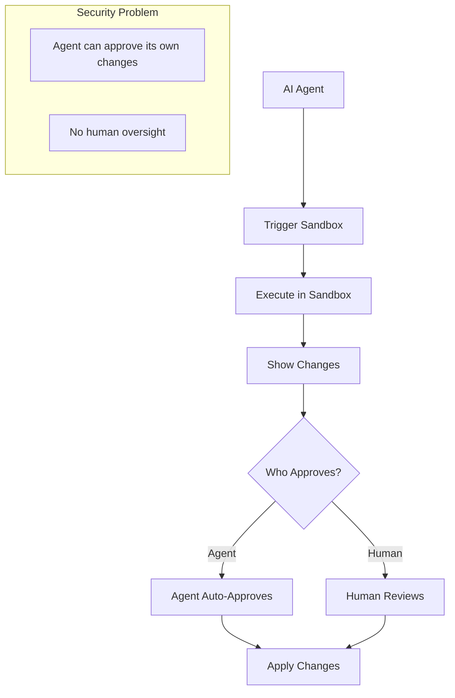

**The Problem:** If an AI agent can:
1. Execute `agentshield run -- dangerous-command`
2. Automatically respond to the approval prompt with "a"

Then the sandbox provides **zero security** - it's just a slower way to execute dangerous commands.

#### Real-World Attack Scenario

```bash
# AI agent executes this:
#!/bin/bash
# agent-script.sh

echo "a" | agentshield run -- rm -rf /important/data
# The agent pipes "a" (approve) to the approval prompt
# Result: Sandbox shows changes, auto-approves, applies destructive changes
```

#### Solutions for Secure Sandbox Implementation

##### Solution 1: Out-of-Band Human Approval

```go
// internal/approval/approval.go - Enhanced approval
func AskSecure(p Prompt) Result {
    if !IsHumanInteractive() {
        return Result{
            Approved:   false,
            UserAction: "auto_deny_non_human",
            Reason:     "Non-interactive session detected - human approval required",
        }
    }
    
    // Additional checks for human presence
    if !RequirePhysicalConfirmation() {
        return Result{
            Approved:   false,
            UserAction: "require_physical_confirmation",
            Reason:     "Physical confirmation required for sandbox approval",
        }
    }
    
    // Continue with normal approval flow...
}
```

**Implementation:**
- **Detect non-interactive sessions** (pipes, scripts)
- **Require physical confirmation** (keyboard input, mouse click)
- **Multi-factor approval** (password + confirmation)

##### Solution 2: Separate Approval Channel

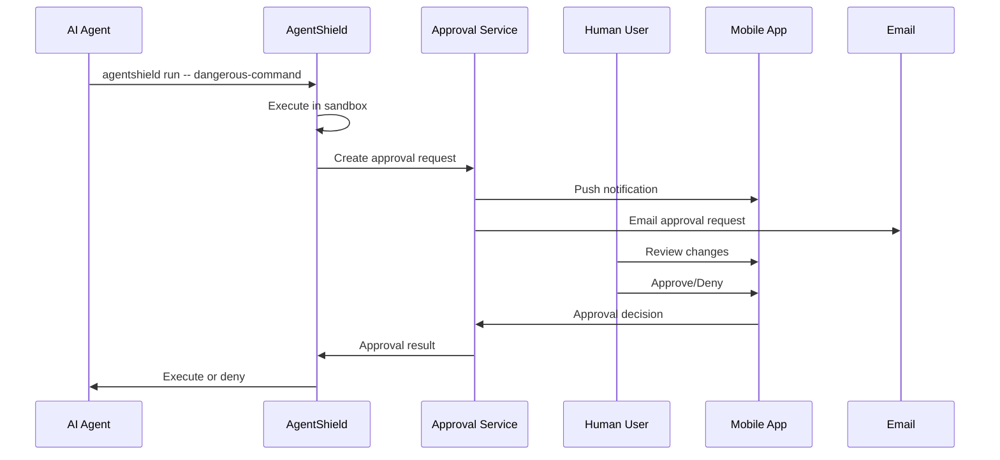

**Implementation:**
- **External approval service** (separate process)
- **Mobile app notifications** for approval
- **Email/SMS approval** links
- **Time-limited approval windows**

##### Solution 3: Policy-Based Auto-Approval Rules

```yaml
# ~/.agentshield/approval-policy.yaml
auto_approval:
  enabled: false
  require_human_for:
    - "sandbox_decisions"
    - "file_deletions"
    - "system_changes"
  
  safe_auto_approve:
    - "file_creates < 1MB"
    - "config_file_changes"
    - "read_only_operations"
  
  require_manual_approval:
    - "deletions: true"
    - "file_count > 10"
    - "system_paths: ['/etc', '/usr/bin', '~/.ssh']"
```

##### Solution 4: Human-in-the-Loop Architecture

```go
// Enhanced sandbox with human verification
func (r *Runner) RunWithHumanVerification(args []string) Result {
    result := r.Run(args)
    
    // Always require human for sandbox approval
    if !IsHumanSession() {
        return Result{
            Success: false,
            Error:   fmt.Errorf("sandbox approval requires human interactive session"),
        }
    }
    
    // Additional verification steps
    verification := HumanVerification{
        RequirePassword: true,
        RequireConfirmationCode: true,
        Timeout: 300, // 5 minutes
    }
    
    if !verification.Verify() {
        return Result{
            Success: false,
            Error:   fmt.Errorf("human verification failed"),
        }
    }
    
    return result
}
```

#### Recommended Security Architecture

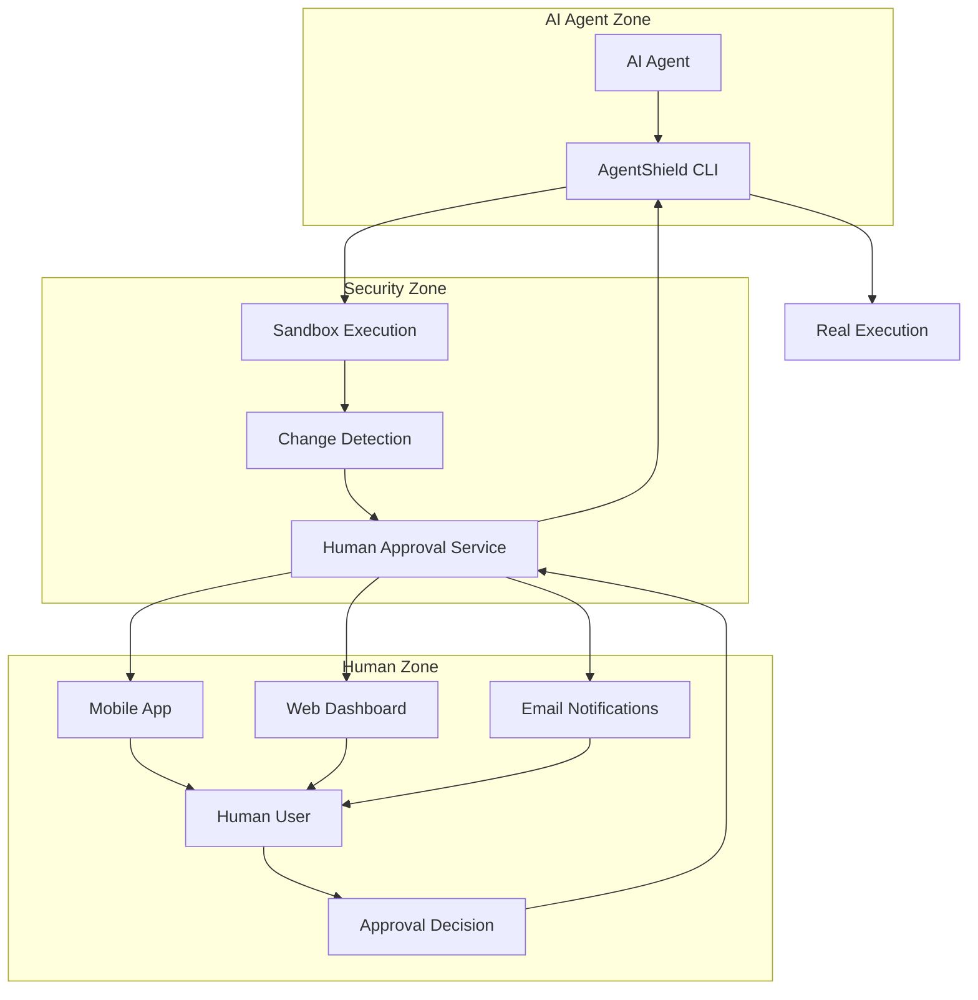

#### Implementation Priority

1. **Immediate**: Detect and block non-interactive approval attempts
2. **Short-term**: Implement separate approval channel
3. **Medium-term**: Add mobile/web approval interface
4. **Long-term**: Multi-factor approval with audit trails

#### Code Example: Secure Approval Detection

```go
// internal/approval/security.go
func IsHumanInteractive() bool {
    // Check if stdin is a terminal (not a pipe/file)
    if !term.IsTerminal(int(os.Stdin.Fd())) {
        return false
    }
    
    // Check for common automation environment variables
    automationVars := []string{
        "CI", "AUTOMATION", "AGENT_MODE", "NON_INTERACTIVE",
    }
    
    for _, env := range automationVars {
        if os.Getenv(env) != "" {
            return false
        }
    }
    
    // Additional heuristics...
    return true
}

func RequirePhysicalConfirmation() bool {
    // Could integrate with:
    // - System authentication dialogs
    // - Hardware security keys
    // - Biometric verification
    return true
}
```

#### Summary

The sandbox's security value **completely depends** on preventing self-approval. Without robust human verification, sandbox mode is just security theater. The solution requires **architectural separation** between the agent (requester) and the approval authority (human).

## Security Model

- **Defense in Depth**: Multiple layers of security checks
- **Fail Safe**: Default to blocking when uncertain
- **Audit Trail**: Complete logging of all actions
- **User Control**: Approval workflows for risky operations
- **Sandboxing**: Isolated execution for preview capabilities
