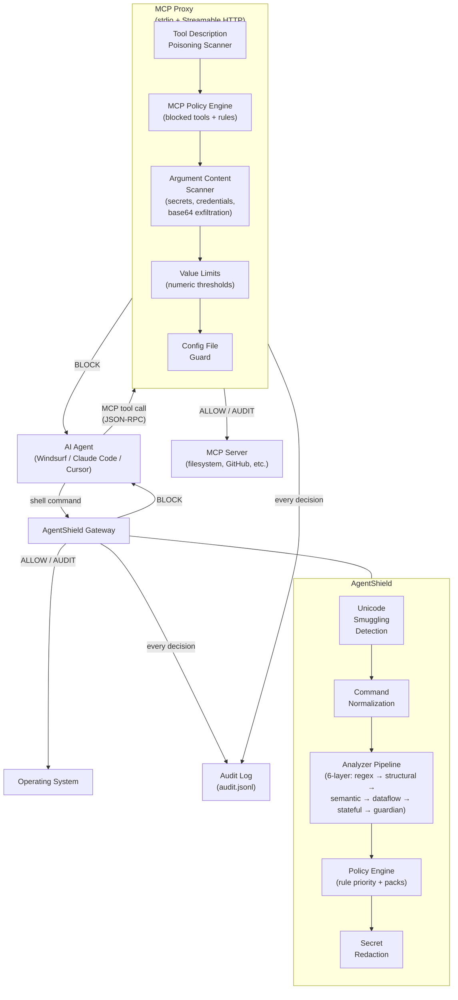

# Architecture

## System Overview

AgentShield mediates two communication channels: **shell commands** and **MCP tool calls**.



## Multi-Layer Analyzer Pipeline

AgentShield uses a six-layer analyzer pipeline for defense-in-depth command analysis.

| Layer | What it does | Example |
|-------|-------------|----------|
| **Regex** | Pattern matching (prefix, exact, regex) | `rm -rf /` matches `^(rm\|sudo rm)\s+-rf\s+/` |
| **Structural** | Shell AST parsing, flag normalization, pipe detection | `rm --recursive --force /` → normalized to `-r -f /` |
| **Semantic** | Intent classification from parsed command structure | `shred /dev/sda` → destructive disk operation |
| **Dataflow** | Source→sink taint tracking through pipes/redirects | `cat /dev/zero > /dev/sda` → zero source to device sink |
| **Stateful** | Multi-step attack chain detection | `curl -o x.sh && bash x.sh` → download-then-execute |
| **Guardian** | Prompt injection signals, obfuscation, inline secrets | `echo "ignore previous instructions"` → instruction_override |
| **Combiner** | Merges findings using most-restrictive-wins strategy | BLOCK from any layer overrides AUDIT |

### What each layer catches

- **Regex only**: Exact patterns like `rm -rf /`, `curl | bash`, `dd if=/dev/zero`
- **Structural adds**: Flag variations (`--recursive --force`), glob evasion (`rm -rf /*`), sudo parsing, string literal detection (won't flag `echo "rm -rf /"`), pipe-to-interpreter (`curl | python3`), symbolic chmod (`a+rwx`)
- **Semantic adds**: Alternative destructive tools (`shred`, `wipefs`, `find -delete`), indirect execution (`python3 -c "shutil.rmtree('/')"`, fork bombs), crontab modification, environment dumps via scripting languages
- **Dataflow adds**: Redirect-based disk destruction (`cat /dev/zero > /dev/sda`), direct cron spool writes, sensitive data piped to network commands, command substitution exfiltration
- **Stateful adds**: Download-then-execute chains (`curl -o x.sh && bash x.sh`), three-step download→chmod→execute sequences
- **Guardian adds**: Prompt injection detection (`ignore previous instructions`), security bypass attempts, obfuscated payloads (base64/hex), inline secrets (API keys, tokens), bulk exfiltration (archive + upload), indirect injection (`SYSTEM:`, `[INST]` tags)

### Analyzer Pipeline Flow


### Evaluation Decision Flow


## Key Packages

| Package | Purpose |
|---------|----------|
| `internal/policy` | Policy engine, rule loading, pack merging |
| `internal/analyzer` | Multi-layer analyzer pipeline (regex, structural, semantic, dataflow, stateful) |
| `internal/guardian` | Prompt injection detection (9 heuristic signals) |
| `internal/mcp` | MCP proxy, policy engine, JSON-RPC parser, description poisoning scanner |
| `internal/taxonomy` | Security taxonomy loader and compliance mapping |
| `internal/unicode` | Unicode smuggling detection |
| `internal/redact` | Secret redaction for audit logs |
| `internal/cli` | CLI commands (`run`, `hook`, `setup`, `mcp-proxy`, `mcp-http-proxy`, `setup mcp`) |

## Agent Action Security Taxonomy

AgentShield includes a structured security taxonomy mapping threats to detection rules:

```
taxonomy/
├── kingdoms.yaml              # 8 threat kingdoms
├── 1-destructive-ops/         # fs-destruction, disk-ops, fork-bombs, chmod
├── 2-credential-exposure/     # ssh-keys, env-dumps
├── 3-data-exfiltration/       # reverse-shells, dns-tunneling
├── 4-unauthorized-execution/  # pipe-to-shell, code injection
├── 5-privilege-escalation/    # sudo abuse
├── 6-persistence-evasion/     # crontab, log deletion
├── 7-supply-chain/            # dependency confusion, registry override
└── 8-reconnaissance/          # network scanning
```

Each taxonomy entry maps to OWASP LLM Top 10 2025 compliance items. See `compliance/indexes/owasp-llm-2025.md`.
