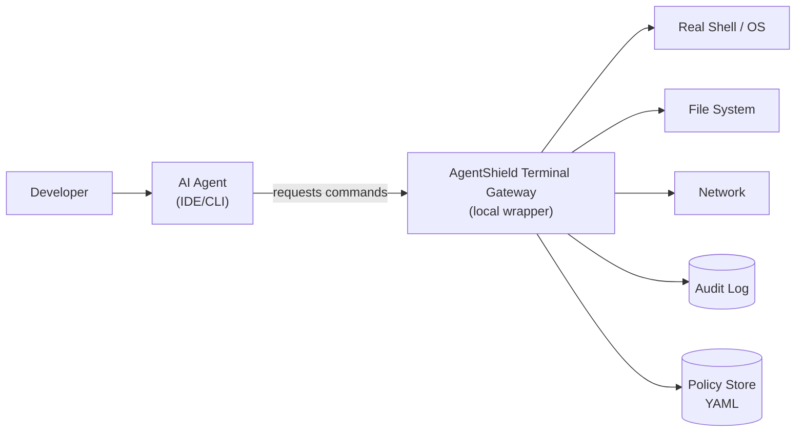
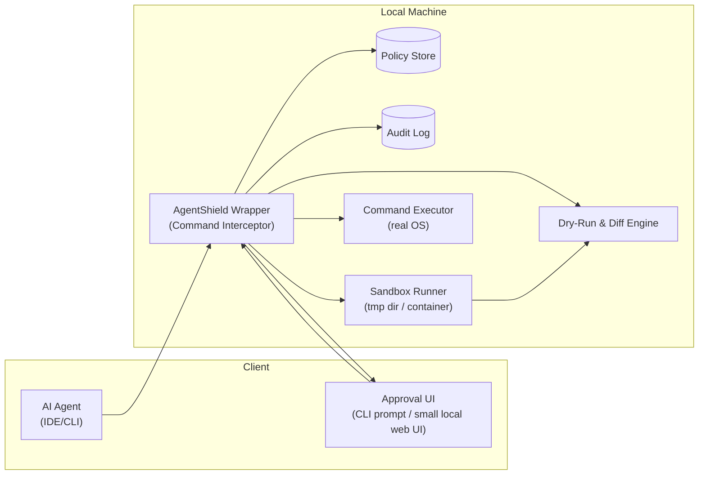
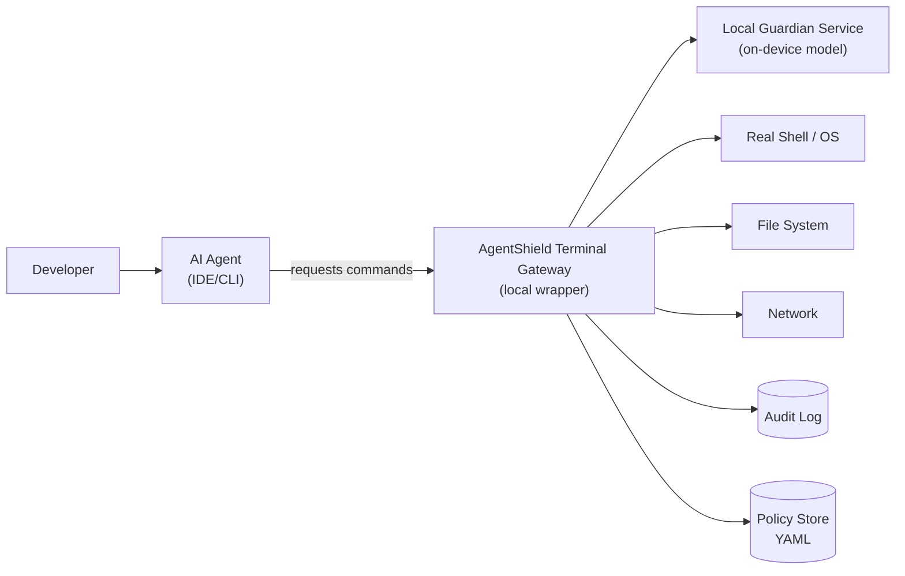
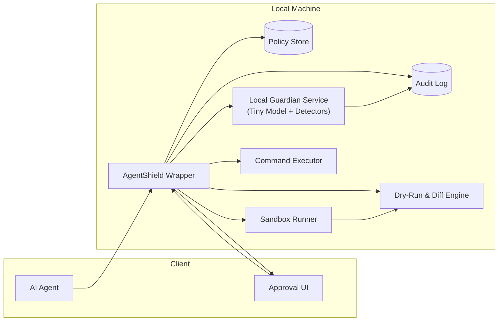
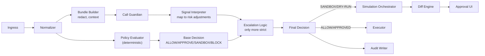
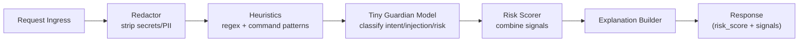

# Terminal Agent Safety Layer — C4 Design (Policy-only vs Policy + Local LLM Guardian)

This document describes a **Terminal Agent Safety Layer** (a local “AgentShield” wrapper) that intercepts shell commands requested by AI agents, enforces policy, and optionally uses a **local guardian model** (Apple Silicon friendly) to detect suspicious intent and reduce prompt-injection-driven damage.

It includes **two scenarios**:
1) **Policy-only** (rules/templates, no LLM)  
2) **Policy + Local LLM Guardian** (rules + on-device risk signals)

---

## Wedge: One Most Valuable Use Case

**Use case:** An AI agent attempts to run a shell command (install packages, modify configs, run scripts).  
**Goal:** Prevent destructive/unsafe changes and data exfiltration by **gating tool execution** with:
- allow/deny rules (least privilege)
- mandatory explanations for risky actions
- sandbox for unknown commands
- dry-run simulation / diff preview for file changes
- audit logs for governance and troubleshooting

---

## Fitness Functions (Architectural Guardrails)

These are measurable constraints that shape every design decision:

1) **Fail Safe**
   - If anything is uncertain (unknown command, ambiguous target, guard unavailable), default to **Require Approval** or **Sandbox**, not direct execution.

2) **Determinism First**
   - Policies decide what is allowed/blocked.
   - (With LLM) model may **escalate** risk; it cannot “waive” a hard deny.

3) **Explainability Required**
   - Any approval prompt/block must show:
     - what command
     - what policy triggered
     - what would change (dry-run diff)
     - remediation (“use sandbox”, “narrow path”, “pin version”, etc.)

4) **Latency Budget**
   - Interception decisions must be fast:
     - Policy-only path: < 50–150ms typical
     - With LLM signals: < 300–800ms typical (local)

---

# Scenario 1 — Policy-only (No LLM)

## C4 Level 1: System Context

### Context Notes
- AgentShield is a **local gateway** sitting between agent and OS.
- It is **not** malware detection; it is **policy enforcement + constrained execution**.

---

## C4 Level 2: Containers

### Container Responsibilities
- **AgentShield Wrapper**: accepts command requests, applies policy, orchestrates sandbox/dry-run/approval
- **Policy Store**: YAML rules (allow/deny/approve; path/domain constraints)
- **Sandbox Runner**: runs commands in isolated environment (dir-copy or container)
- **Dry-Run & Diff Engine**: simulates changes and produces summary/diff
- **Approval UI**: human-in-the-loop for risky actions
- **Audit Log**: append-only trail of decisions and actions

---

## C4 Level 3: Components (inside AgentShield Wrapper)

```mermaid
flowchart LR
  Ingress["Ingress<br/>Receive Request<br/>(cmd,cwd,env)"] --> Normalize["Normalizer<br/>parse argv, canonicalize paths"]
  Normalize --> Classify["Risk Classifier<br/>(rule-based)"]
  Classify --> PolicyEval["Policy Evaluator<br/>(YAML rules)"]
  PolicyEval --> Decision["Decision Engine<br/>ALLOW / APPROVE / SANDBOX / BLOCK"]

  Decision -->|"SANDBOX or DRY-RUN"| Sim["Simulation Orchestrator"]
  Sim --> SandboxRun["Sandbox Runner Adapter"]
  SandboxRun --> DiffEng["Diff Engine<br/>files changed + summary"]
  DiffEng --> Approval["Approval Prompt Builder"]

  Decision -->|"REQUIRE_APPROVAL"| Approval
  Approval --> UI["Approval UI Adapter"]
  UI --> Decision2["Decision Finalizer<br/>approve/deny/partial apply"]

  Decision2 --> Exec["Executor Adapter<br/>real OS"]
  Exec --> Audit["Audit Writer"]
  Decision --> Audit
```

### Policy Model (MVP concept)
- **allow**: safe read-only commands (e.g., `ls`, `pwd`, `git status`)
- **require_approval**: installs, network, file writes, privileged operations
- **deny**: destructive patterns (e.g., `rm -rf /`, reading `~/.ssh`, sending env vars)
- **constraints**:
  - path allowlist/denylist
  - domain allowlist for network
  - package manager constraints (pin versions, block “curl|sh”)

---

## Primary Flow (Policy-only)
1. Agent requests command via wrapper
2. Wrapper normalizes + classifies risk (rules)
3. Policy decides:
   - ALLOW → execute directly
   - REQUIRE_APPROVAL → prompt user (with reason)
   - SANDBOX/DRY-RUN → run in sandbox + show diff → user approves/apply
   - BLOCK → deny with explanation
4. Write audit record

---

# Scenario 2 — Policy + Local LLM Guardian (On-device signals)

## What changes?
We add a **Local Guardian Service** that runs a small model on-device to detect fuzzy risks:
- prompt-injection / instruction override language in the agent’s rationale
- suspicious intent (exfil, persistence, privilege escalation)
- “social engineering” patterns (“disable checks”, “just run this one line”)
- risky command patterns that are hard to capture via regex alone

**Hard rule:** model can only escalate risk. It cannot override hard denies.

---

## C4 Level 1: System Context

---

## C4 Level 2: Containers

### Guardian Inputs (redacted bundle)
- command + args (canonical)
- cwd + targeted paths (expanded)
- agent-provided explanation (required for risky ops)
- recent command context (last N)
- optional: file-change summary from dry-run

### Guardian Outputs
- `risk_score` (0–1)
- `signals[]` (e.g., “exfil intent”, “privilege escalation”, “instruction override”)
- short explanation (human-readable)
- confidence

---

## C4 Level 3: Components

### 3A) AgentShield Wrapper (with guardian signals)

**Escalation examples**
- ALLOW → REQUIRE_APPROVAL if guardian sees “exfil intent”
- REQUIRE_APPROVAL → SANDBOX if guardian sees “unknown download + execute”
- SANDBOX stays SANDBOX; BLOCK stays BLOCK

---

### 3B) Local Guardian Service Components

---

## Primary Flow (Policy + local LLM guardian)
1. Agent requests command, provides explanation for risky classes
2. Wrapper runs deterministic policy checks
3. Wrapper calls guardian with redacted bundle
4. Guardian returns risk signals; wrapper escalates as needed
5. If SANDBOX/DRY-RUN: run in sandbox, show diff/summary
6. User approves or denies; wrapper executes (or blocks) accordingly
7. Audit log persists the full decision trail

---

# Appendix — “Dry Run” Strategies (MVP-friendly)

**Strategy A (repo-aware):**
- If working directory is a git repo:
  - run command in sandbox copy
  - compute `git diff --stat` and `git diff`
  - show file list + lines changed

**Strategy B (filesystem snapshot):**
- Take a directory snapshot (hash tree) pre/post sandbox run
- Show changed/added/removed files

**Strategy C (command-specific simulation):**
- Prefer native dry-run flags when available:
  - `rsync --dry-run`
  - `terraform plan` (plan vs apply)

MVP recommendation: **A + B** (simple, robust).

---

# Appendix — Example Policy Rules (conceptual)

- **Deny**
  - any access to `~/.ssh/**`, `~/.aws/**`, `~/.gnupg/**`
  - deleting outside workspace allowlist
  - `curl|wget ... | sh` (pipe-to-shell)

- **Require approval**
  - package installs (`brew`, `apt`, `pip`, `npm`)
  - network calls to non-allowlisted domains
  - chmod/chown, sudo, launchctl

- **Sandbox**
  - unknown binaries or scripts
  - commands that write many files
  - “download then execute” patterns even with approval

---

# Appendix — How this integrates with different agent types

- **CLI agents**: `agentshield run <agent>` wraps environment (PATH/tooling) so agent calls go through gateway.
- **IDE agents**: integrate via:
  - MCP/tool-server proxy (preferred when supported)
  - configure terminal runner to point to wrapper (when available)
  - otherwise: protect the underlying shell the IDE invokes.

---

## What this is NOT
- Not a guarantee against all prompt injection
- Not an antivirus / EDR

It is **zero-trust policy + constrained execution** for **agent tool calls**.
